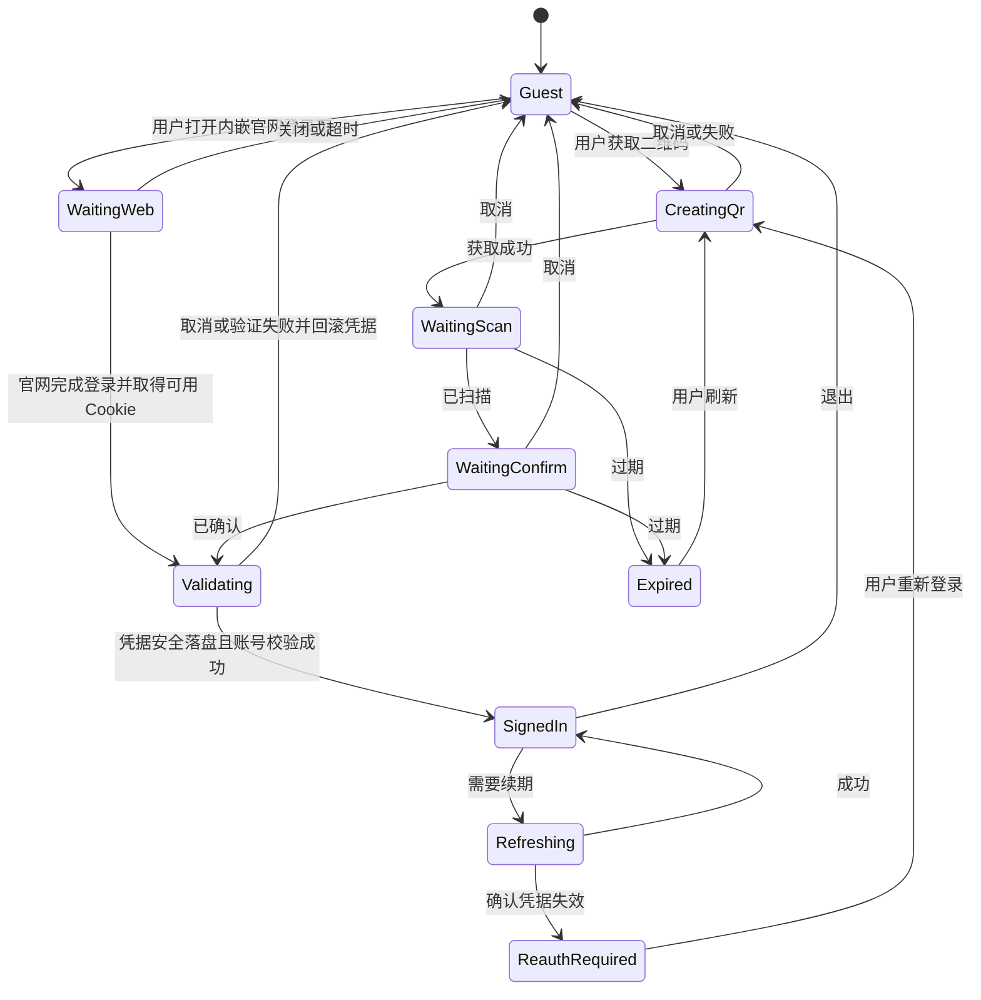

# API、鉴权与数据边界

期期：2026-10-05。本文定义目标契约；表中的接口来自本地参考代码，尚未对在线 Bilibili 服务验证。

## 1. 从 bili-kernel 借鉴什么

`bili-kernel` 是 .NET API 包装器，不是 Rust 内核。借鉴其 `Abstractions → Services → Core/Authenticator/Http → Resolvers` 的职责拆分、统一模型和取消能力。在 Dart 中重建这些边界，不通过 .NET 运行时桥接，也不把源码目录整体复制为依赖。

`bili_api` 的目标结构：

```text
lib/src/
├── transport/          # Dio HTTP、可选 gRPC、WebSocket 传输
├── endpoints/          # host、path、method、auth、响应格式、重试/能力策略
├── auth/               # SessionProvider、Cookie、CSRF、WBI、设备上下文
├── clients/            # AuthClient、CatalogClient、PlayerClient、LiveClient 等
├── models/             # 公共 Api* 类型；不含 Flutter 类型
├── dto/                # 内部 JSON/Protobuf 数据结构
├── mappers/            # 协议 DTO -> Api* 类型
├── codecs/             # 直播包、Protobuf、压缩
└── errors/             # ApiFailure、TransportFailure、ProtocolFailure
```

公共入口显式导出支持的类型，不让调用方导入 `src/`。主应用 Repository 在这里之上处理缓存、离线、产品领域模型；API 包不负责 UI 提示。

## 2. 协议优先级

MVP 优先 **Web REST + Web Cookie + 按端点配置 WBI/CSRF**，视频弹幕使用 HTTP 返回的 Protobuf，直播消息使用 WebSocket。收到 Protobuf 字节并不意味着必须使用 gRPC。

App/TV token 与 gRPC 是后续能力选项，按功能接入。参考项目中的 App/TV 请求参数不能直接与 Web Cookie 登录拼接；一个会话只具有实际取得的凭据，缺少 app token 时明确返回能力不可用。

| 通道 | MVP 策略 | 原因 |
| --- | --- | --- |
| Web REST / JSON | 主通道 | 先完成 Cookie 登录、搜索、详情、播放链路 |
| HTTP / Protobuf | 点播弹幕必需 | 元信息和分段解码，生成最小 schema |
| WebSocket / 二进制包 | M3 直播必需，M0 提前验证 | 分离聊天室连接与媒体播放 |
| gRPC | 延后，缺少 Web 能力时评估 | 多一套 metadata、token、压缩与 schema 维护 |
| App/TV REST | 延后，独立 ApiProfile | 必须验证登录态、签名、设备上下文与服务端可用性 |

## 3. 请求契约与流水线

以下是设计示意，尚不是可直接编译的 Dart API：

```dart
EndpointSpec {
  id, host, path, method,
  profile,                 // web / app / tv
  authPolicy,              // guestAllowed / cookieOptional / cookieRequired / appTokenRequired
  signingPolicy,           // none / wbi / appSign
  csrfPolicy,              // none / required，含具体参数名与位置
  responseFormat,          // json / protobuf / binary
  retryPolicy,             // readOnlyBounded / noAutomaticRetry
}

RequestContext {
  accountScope, sessionEpoch, deadline, cancellation, operationId
}

ApiPage<T> { items, nextCursor, hasMore }
```

流水线：校验输入 → 固定会话快照 → 检查端点能力 → 准备设备/Cookie → 获取签名上下文 → 对最终参数签名 → 发请求 → 校验 HTTP/业务状态 → 解码 DTO → 转为 `Api*` → Repository 形成领域结果。

- 参数保留未编码值，到 transport 边界只编码一次。排序、空格、中文、特殊字符和时间戳有固定样例测试，不能照抄参考代码中的字符串拼接。
- `ApiSessionProvider` 只向 auth/transport 提供必需的凭据快照；调用方拿到 `SessionSummary`，没有 Cookie/token 明文。
- 超时分连接/响应/总 deadline；取消信号传到网络、解析队列和 Repository，取消不是需要 toast 的失败。
- 每个重试周期固定账号；会话改变即取消。签名需要新时间戳时重签最终参数，不能重复发送已过期的签名。
- 长 ID 用领域值对象承载，边界序列化为十进制字符串；Protobuf int64 转换时校验范围，避免通过浮点数转换。

## 4. 接口能力映射

来源缩写：K = `bili-kernel/src`，U = `biliuwp-lite/src/BiliLite.UWP`。具体可点击入口见 [参考映射](references.md)。下表是迁移定位清单，不是在线成功清单；尤其播放、历史、动态中的 Web/App 差异要逐项验证。

| 能力/阶段 | 参考端点或方法 | 源码入口 | Flutter 归属及验证点 |
| --- | --- | --- | --- |
| 扫码登录 M0/M2 | `/x/passport-login/web/qrcode/generate`、`/poll` | U `Models/Requests/Api/AccountApi.cs` | AuthClient；Web 二维码与 Set-Cookie，取消/过期/确认 |
| 密码/短信登录（提前实现） | 内嵌 `https://passport.bilibili.com/login`；应用调用 `/x/web-interface/nav` 验证 | U AccountApi、LoginVM、LoginDialog；dart_simple_live Web 登录页 | Platform WebView → 会话控制器；保留 Cookie 作用域、账号校验和安全存储；不在 API 包维护官网表单 POST；见 [登录验证](validation/password-sms-login.md) |
| TV 登录（后续） | `/x/passport-tv-login/qrcode/auth_code`、`/poll` | K `Authorizers/Authorizers.Tv/Core/TvAuthorizeClient.cs` | 独立 TV profile，不作为 Web 登录的隐式副作用 |
| 会话与 WBI M0/M2 | `/x/web-interface/nav`、cookie info/refresh/confirm | K `BiliKernel.Abstractions/Bili/BiliApis.cs`、Core Authenticator；U AccountApi | SessionStore；刷新要取得所需 refresh 数据，缺失则重新登录 |
| 推荐 M2 | `/x/web-interface/index/top/feed/rcmd`；App `/x/v2/feed/index` | K `Services/Services.Media/Core/VideoDiscoveryClient.cs` | CatalogClient；优先验证 Web，不能把 App token 参数搬过来 |
| 热门/排行 M2 | `GetHotVideoListAsync`、`/x/web-interface/ranking/v2` | K VideoDiscoveryClient | 区分 gRPC 热门与 REST 排行；MVP 首页可先用已验证推荐/排行 |
| 搜索 M2 | `/x/web-interface/wbi/search/type`、`/all/v2` | K `Services/Services.Search/Core/SearchClient.cs` | SearchClient；WBI、Cookie、排序及分页 |
| 视频详情 M0/M2 | `/x/web-interface/view/detail`、`GetVideoPageDetailWithRestAsync` | K `Services/Services.Media/Core/PlayerClient.cs` | VideoRepository；bvid/aid 解析、cid、分 P、合集 |
| 视频标签 M2 | `/x/tag/archive/tags` | U `Models/Requests/Api/VideoAPI.cs`、VideoDetailPageViewModel | VideoExtrasRepository；独立只读、BV 身份隔离和点击关键词搜索，见 [视频标签与搜索](validation/video-tags.md) |
| 视频播放 M0/M2 | `/x/player/playurl`、`GetVideoPlayDetailWithRestAsync` | K PlayerClient | PlaybackResolver；参考调用混有 App 参数，须独立验证 Web profile |
| 字幕/章节附加信息 M2 | `/x/player/wbi/v2` | K `Services/Services.Media/Core/SubtitleClient.cs` 与 PlayerClient；PiliPlus `view_points` 字段 | PlaybackMetadataRepository；合并一次 WBI 读取，字幕/章节故障独立；见 [实现验证](validation/playback-timeline.md) |
| 视频悬停缩略图 M2 | `/x/player/videoshot` | PiliPlus 雪碧图协议；来源/许可见 [实现验证](validation/playback-timeline.md) | PlaybackMetadataRepository；Web 只读，按播放源懒加载、索引/网格校验与公开图片缓存 |
| 视频弹幕 M0/M2 | `/x/v2/dm/web/view`、`/x/v2/dm/web/seg.so` | K `Services/Services.Media/Core/DanmakuClient.cs` | DanmakuRepository；Protobuf、分段数、毫秒进度、空分段 |
| 直播播放 M0/M3 | `/xlive/web-room/v2/index/getRoomPlayInfo` | K PlayerClient | LiveRepository；真实 roomId、协议/格式/编码、线路、开播状态 |
| 直播消息 M0/M3 | `/xlive/web-room/v1/index/getDanmuInfo`、EnterLiveRoomAsync | K PlayerClient | LiveChatSession；token/host、鉴权、分包/合包、心跳 |
| 直播 SC M3 | `/av/v1/SuperChat/getMessageList` | U `LiveRoomAPI.RoomSuperChat` | Web GET、Cookie 可选、无签名；LiveRepository 读取快照，20 秒有界刷新与本地过期清理 |
| 收藏/稍后再看 M3 | `/x/v3/fav/resource/list`、`/x/v2/history/toview` | K `Services/Services.User/FavoriteService.cs`、Core/MyClient、Core/ViewLaterClient | LibraryRepository；账号隔离、分页、删除操作反馈 |
| 历史/进度 M2/M3 | `/x/v2/history/report`、GetHistory 类接口 | K `Services/Services.User/Core/ViewHistoryClient.cs`、PlayerClient | 本地续播 M2；云读取/上报 M3，先核验 Web 或独立 App 通道 |
| 评论 M3 | CommentClient 中的读取及写入方法 | K `Services/Services.Comment/Core/CommentClient.cs` | CommentRepository；root/rpid、游标，先读后写 |
| 动态/用户 M3 | MomentClient、MyClient、RelationshipService | K Services.Moment、Services.User | 各模块单独登记可用协议，MVP 不承诺完整 gRPC 迁移 |
| 动态分享/评论/点赞（提前实现） | Web `/x/dynamic/feed/dyn/thumb`、`/x/dynamic/feed/create/dyn`，复用 `/x/v2/reply/*` | U DynamicAPI / 动态详情；K MomentAdapter / CommentTargetType；官网动态 Web 脚本 | 独立 DynamicRepository、共用 CommentsRepository；按 basic 评论身份隔离，JSON query CSRF 单次写，见 [动态交互登记](validation/dynamic-interactions.md) |
| 账号摘要与消息（提前实现） | `/x/web-interface/nav/stat`、`/x/msgfeed/*`、VC 会话/私信、`/x/sys-msg/query_user_notify` | U HomePage、MessageApi；K MessageService、MyClient | AccountClient/MessageClient；Web Cookie、十进制游标、CSRF 单次写、账号隔离；见 [实测登记](validation/account-messages.md) |
| PGC M4 | GetPgcPageDetailAsync / GetPgcPlayDetailAsync | K PlayerClient、PgcClient | PgcRepository；season/episode、权益和区域结果 |

每个实际接入的端点必须记录：host/method、参数、profile、鉴权/签名、脱敏响应 fixture、最后验证期期、失败码、降级策略。文件名中出现 Web 或 BiliApis 常量存在都不足以证明某种登录态能使用它。

我的收藏现有五类子标签和主页收藏视频读取，仍由现有 HomeRepository/ProfileRepository 编排。自建收藏夹元信息与编辑由 FavoriteFolderRepository 编排，Web Cookie/CSRF 单次提交，未知结果通过读取核对。默认收藏夹 ID、收藏/订阅合集类型、Web 追番/追剧、私密/创建日期及读写验证边界见 [收藏子标签与视频卡片](validation/favorites-tabs.md)。

“我的收藏与订阅”的卡片支持用户确认后取消普通收藏夹收藏或 UGC 合集订阅，分别使用 `/x/v3/fav/folder/unfav` 与 `/x/v3/fav/season/unfav` 的 Web Cookie/CSRF 单次 POST。写操作不自动重试，成功后隔离迟到列表响应并重新协调分页；协议、确认交互及未实测边界见 [收藏与订阅取消操作](validation/favorites-unsubscribe.md)。

推荐与稍后再看的视频卡标题菜单分别接入 Web POST `/x/web-interface/feedback/dislike`（内容不感兴趣，`reason_id=1`）与 `/x/v2/history/toview/del`（按 `aid` 删除），添加沿用 `/x/v2/history/toview/add`。反馈使用本次推荐响应的内容身份和 `track_id`，没有对应上下文时明确提示不可反馈。推荐反馈成功保留原卡片位置并显示遮罩，用户可显式调用 `/x/web-interface/feedback/dislike/cancel`，携带原成功反馈上下文；撤销确认成功才恢复卡片。稍后再看删除成功才移除卡片。四项操作只由明确点击触发，沿用 Cookie/CSRF、账号 scope/session epoch、取消与单次写入，未知结果不重放。端点参数、来源及实际验证边界见 [视频卡操作菜单](validation/video-card-menus.md)。

视频播放页合集标题接入订阅状态与显式订阅/取消，按当前视频 `aid`／`bvid` 读取 `/x/web-interface/archive/relation` 的布尔字段 `season_fav`，不扫描账号收藏列表；写操作仍为 `/x/v3/fav/season/fav`、`/x/v3/fav/season/unfav` 单次 POST。合集详情的公开响应没有 `fav_state`，但这不能证明其他接口没有订阅状态，官网关系接口与按钮逻辑的核对依据见 [合集订阅按钮](validation/collection-subscription.md)。已关注 UP 菜单增加设置分组，读取 `/x/relation/tags`、`/x/relation/tag/user`，保存至 `/x/relation/tags/addUsers`；见 [关注用户分组](validation/follow-groups.md)。两者沿用 Web Cookie/CSRF、取消与账号 scope/session epoch 隔离，真实账号写入待用户验收。

影视与直播已按用户本轮要求提前接入 Web 详情/播放/历史聊天；上述 M3/M4 定位仍是整体路线。实际已实现端点、取消与权限语义、游客烟测见 [影视与直播内置播放](validation/content-playback.md)。官方影视侧栏及 SC 快照端点、容量和前序验证见 [影视侧栏与直播 SC](validation/pgc-live-sidebar.md)。后续剧集弹幕/发送、直播实时连接与消息、SC 合并及当前分区列表协议见 [影视与直播弹幕修复](validation/pgc-live-danmaku.md)。

搜索现已接入七类 Web 搜索；综合接口用于混合模块与分类总数，视频排序/筛选/分页固定使用 `search/type`，不依赖综合接口对 `order` 的忽略行为。各类参数与实测见 [搜索分类与排序](validation/search-categories.md)。

## 5. 会话与凭据

普通视频/影视云端进度按用户要求接入 Web GET `/x/player/wbi/v2` 与 POST `/x/click-interface/web/heartbeat`：本地优先、云端仅在本地缺失时补充，上报使用已有 Web Cookie/CSRF，单次写入不重放，不使用参考实现的 App 签名。字段单位、容量、取消和验证边界见 [云端播放进度](validation/cloud-playback-progress.md)。上表 `/x/v2/history/report` 保留参考源码定位，不是本项目的 Web 上报端点。

观看历史页面另由 `WatchHistoryClient` / `ApiLibraryRepository` 读取 Web Cookie GET `/x/web-interface/history/cursor`，使用服务端三字段游标分页，以视频详情补齐统计并显示观看日期。该列表不读取本地续播记录；端点、容量、来源和验证边界见 [云端观看历史](validation/cloud-watch-history.md)。

### 登录状态机



QR 轮询按服务端状态和间隔执行，只有一个活跃轮询；关闭弹窗、应用后台、二维码过期要停止或挂起。网络错误保留可恢复状态，不能自动无限刷新二维码。

Cookie 由 domain/path/secure/expiry 规则的 CookieStore 维护，持久化整个必要的作用域信息，不能只保存 `name=value` 字符串。接收 Set-Cookie 时检查来源域，限制跳转后的凭据发送；账号 Cookie 不发送到任意 CDN、字幕外链或外部浏览器。

会话刷新使用单飞：同一账号并发请求共享一次刷新，成功后仅按策略重放可安全重试的读请求。禁止每个 401 单独刷新；Bilibili 的业务码也可能表示失效，应经端点映射识别。密码／短信及验证码由内嵌官网完成，应用不持有表单字段、不保存密码、不自动提交登录写请求；只导入适用于 API 根路径的 Cookie，经 nav 校验后安全保存。账号验证有 25 秒 deadline，网页登录等待最多 10 分钟；网页等待允许用户切换应用查看短信，返回前暂停 Cookie 提取。协议与平台边界见 [登录验证](validation/password-sms-login.md)。

退出流程：递增 epoch → 取消账号请求/QR/WS/上报 → 停止依赖该账号的播放和下载 → 清理内存凭据与安全存储 → 清理私有缓存 → 进入 guest。离线文件单独询问用户是否删除，不能让普通退出自动破坏文件。

### WBI、CSRF 与设备上下文

- WBI key 由 nav 信息建立，缓存并记录取回时间；签名失败时只允许一次重新获取和重签。参数 canonicalization 用 fixture 校验；不能硬编码某次抓到的 key。
- WBI key 更新与会话刷新是不同流程，各自合并并发请求。外部时钟可注入测试，生产使用 UTC 时间戳。
- CSRF 从当前 Cookie 会话取得，按端点规定放 query/body；Web CSRF 与 App 签名不是替代关系。
- buvid 等设备上下文由协议模块按需要获取和持久化，保持同一安装内一致；不能每次请求随机生成或全局伪造设备参数。
- App/TV 若未来启用，独立声明 app key、签名和 token 所需上下文；客户端内的静态参数不被当作能安全保存的秘密。

## 6. 重试、降级和错误

`ApiFailure` 至少携带 `category`、`endpointId`、`httpStatus?`、`businessCode?`、`retryAfter?`、脱敏 `diagnosticId`；主应用将它转换为 `AppFailure`。

| 情况 | 行为 |
| --- | --- |
| 取消、旧 epoch、旧 query | 停止，不 toast，不重试，不写缓存 |
| 网络断开/超时/部分 5xx | 对读请求最多额外 2 次，指数退避+抖动，遵守总 deadline |
| 限流或风控 | 停止自动重试，遵守 Retry-After 或冷却；向用户显示可恢复状态 |
| 认证失效 | 单飞刷新或重新登录；不循环切换 Web/App/TV |
| 内容不存在/权限不足/区域受限 | 明确不可用；不尝试其他通道绕过服务端限制 |
| DTO 缺关键字段或 Protobuf 失败 | ProtocolFailure；保留脱敏结构摘要，不能转成空成功结果 |
| 支持的端点兼容性故障 | 仅对预先登记、同权限语义的读接口降级一次，记录所用来源 |
| 点赞/投币/收藏/发送等写操作超时 | 不自动重放；查询服务端状态后反馈或允许用户明确重试 |

端点降级在 Repository/能力策略层可见，不能 `catch (Exception)` 后依次遍历全部 API。网络请求去重只合并相同账号、端点和参数的在途只读请求，不跨账号缓存响应。

## 7. 协议健壮性和版本

JSON 解析容忍新增可选字段；关键 ID、枚举和格式缺失时形成显式错误。未知直播命令可计数后忽略，不能让聊天室退出。

Protobuf 只引入所需消息及传递依赖，记录源提交、生成器版本、生成命令；生成物不得手改。Schema 或映射修改应带来自脱敏真实响应的回归 fixture。

未来 gRPC 应使用经过验证的客户端/编解码实现，校验完整的 5 字节消息前缀、32 位长度、压缩标志、状态和 trailers；测试超过 255 字节、分段和损坏消息。参考 `BiliHttpClient.CreateRequest` 的单字节长度写法不能直接迁移。

直播包解析必须限制单包长度、解压后体积、递归层级和队列大小；使用 WebSocket 库的完整 message 语义并在其内按协议长度继续拆包，不将一个回调等同于一个 Bilibili 消息。详见 [直播设计](playback-and-danmaku.md#6-直播媒体与消息)。

保持系统 TLS 证书校验，参考内核中的无条件接受证书回调不得迁入。测试服务通过注入 transport 替身实现，不靠生产关闭校验。

## 8. 验证方式

下载源沿用既有 Web playurl、字幕索引/正文与弹幕分段端点；解析精确画质/编码和 AAC，PGC `is_preview` 显式拒绝。媒体传输独立使用系统 TLS 的 HttpClient，仅带公开 Referer/User-Agent，不传 API Cookie；任务持久化无签名 URL。协议、容量和恢复验证见 [下载与离线播放](downloads.md)。

单测覆盖：WBI 参数/时间/并发更新、Cookie 作用域、会话刷新单飞、登录退出竞态、DTO 空字段/未知枚举、页码与游标、失败分类、写请求不重试、Protobuf 与压缩边界。

离线 fixture 不包含真实账号、Cookie、带签名播放 URL、扫码 key 或聊天隐私。常规 CI 只使用 fixture/local server；在线 smoke 为开发者主动触发、低频、只读。验收记录注明账号态、SDK/依赖版本、OS、期期，不记录凭据。

首轮至少取得 guest 与 signed-in 的详情、搜索、playurl、弹幕响应对照；建立“参考实现 → fixture → Dart 测试 → 真实烟测”的证据链后再宣称接入完成。[Dio 的能力和配置](https://pub.dev/packages/dio) 仅支撑传输选型，具体鉴权策略以本项目验证为准。

