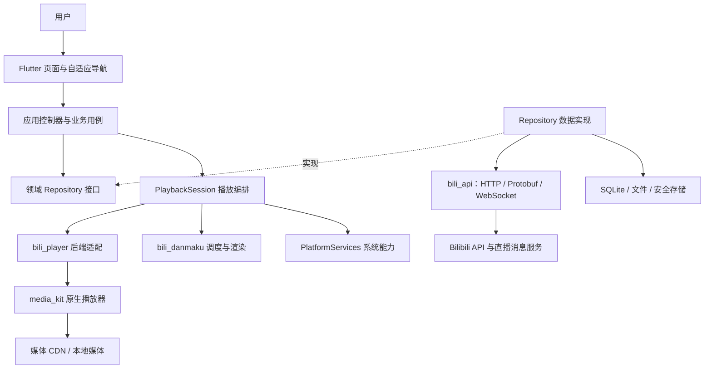

# 整体系统架构

日期：2026-10-05。状态：本文件描述完整目标架构；0.1.0 已实现 Windows 预览闭环，逐项证据见 [M0 实测记录](validation/m0-results.md)。其他平台和长期稳定性仍待验。

## 1. 目标与范围

BiliSail（哔帆）是一个专注观看体验的跨平台 Bilibili 第三方客户端，以视频和直播为中心。首要目标是播放稳定、弹幕流畅、移动与桌面交互自然，以及 API 变化时可以局部修复。

首批交付 Android arm64、Windows x64、macOS arm64。Windows 先作为本地调试入口，但 Android 和 macOS 从 M0 就必须进入验证矩阵。Android x64 用于模拟器；Windows arm64、macOS Intel、Linux、iOS 属于后续扩展。Web 不列入本轮范围，其 CORS、Cookie、解码器和后台能力需要单独方案。

拟定最低系统为 Android API 24、Windows 10、macOS 12；它们是初始验证下限。M0 选择具体 Flutter SDK 和插件版本后，按它们支持范围的交集锁定最终下限和 ABI，不引用某个播放器包的较低系统要求代替 Flutter 的要求。[Flutter 支持平台](https://docs.flutter.dev/reference/supported-platforms)

### 功能层次

| 阶段 | 纳入能力 |
| --- | --- |
| 核心 MVP（M2） | 游客浏览、扫码登录、首页、搜索、视频详情/分 P、UGC 点播、普通弹幕、字幕、清晰度/倍速、全屏、设置、本地续播 |
| 日常使用（M3） | 直播观看与弹幕、动态只读、UP 主空间、收藏/稍后再看/云历史、评论阅读、用户显式触发的点赞/投币/收藏 |
| 完整版本（M4） | 下载与离线播放、PGC 番剧/影视、媒体键、平台支持时的后台音频/PiP、体验完善 |
| 后续扩展 | 评论/弹幕发送、私信、发动态、多账号切换、多窗口、投屏、高级弹幕、更多系统 |

不在初期实现服务端账号代理、视频转码服务、插件市场、广告系统、付费权限替代或完整复刻 UWP 的全部功能。PGC 权限、地区、账号状态按服务端结果展示。

按用户本轮需求已提前接入番剧/国创/放映厅的影视页和直播房间页，三类播放页面共用 `PlaybackSession` 契约，各播放标签持有独立实例。多标签可按播放设置允许并发，单标签或关闭并发开关时由 `PlaybackManager` 协调互斥。这只完成这些模块的内置观看闭环，不代表完整 M3/M4 或三端 M0 验收；实际协议、历史迁移与未测项见 [影视与直播内置播放](validation/content-playback.md) 和 [多标签并发播放](validation/multi-tab-playback.md)。

## 2. 技术栈与决策

按用户要求提前实现头像账号菜单与 Web 消息收件箱，见 [账号菜单与消息](validation/account-messages.md)。`auth` 负责账号摘要和菜单，`messages` 的纯 Dart Repository 契约与应用控制器负责读取、私信发送和显式已读；`app` 通过账号消息指示端口注入未读数，避免两个 Feature 循环依赖。账号 scope、session epoch、请求代次共同隔离旧响应；私信与草稿只在有界内存中保留。此项不代表完整 M3/M4 或三端验收。

| 层面 | 方案 | 理由与限制 |
| --- | --- | --- |
| UI | Flutter stable + Dart，Material 3 为基础的自有主题 | 共用组件与状态，按窗口和输入方式调整布局 |
| 状态与注入 | `flutter_riverpod`，Notifier/AsyncNotifier | Provider 负责组装和生命周期；不再叠加全局 service locator |
| 路由 | `go_router` | 声明式路由、导航栈、深链入口 |
| API | 纯 Dart `bili_api` + `dio` | 便于单测和协议调整；HTTP 客户端不泄漏到界面 |
| 数据模型 | Dart 不可变类型；复杂联合状态按需用 `freezed`，JSON 按需生成 | Domain 不依赖 JSON/Protobuf 字段；避免为简单类型强制生成 |
| 播放 | `bili_player` 封装 `media_kit`、`media_kit_video`、视频原生库 | 首选后端，须通过 DASH/直播/请求头三端验证；`fvp` 是备选 |
| 弹幕 | `bili_danmaku`：Dart 调度 + Flutter Canvas/TextPainter | 先实现滚动/顶部/底部；渲染适配器允许接入实测合格的现成包 |
| 持久化 | Drift/SQLite、安全存储、文件缓存 | 结构化数据、凭据、媒体文件分别管理 |
| 并发 | Dart async + 有界任务队列；重解析放 isolate | 不把异步网络请求等同于 CPU 并行 |
| 原生系统能力 | Flutter 插件，缺口才写 Kotlin/Swift/C++ 适配 | 仅平台层接触系统 API |
| Rust | 暂不作为 MVP 必需依赖 | 通过性能数据或明确的跨语言复用需求决定是否引入 FRB |

UI/数据分离与 Repository 边界参考 [Flutter 架构建议](https://docs.flutter.dev/app-architecture/recommendations)。选 Riverpod、按功能组织目录和下面的包边界是本项目决定。包版本在 M0 实际解析、构建后锁定，设计阶段不写猜测版本。

## 3. 系统上下文与依赖

应用默认直接连接 Bilibili 的 API、媒体 CDN 与直播消息服务，不部署中间服务。账号凭据保存在本机；UI 不直接发协议请求。



注意：原生播放器自己访问 CDN，Dart 的 Dio 拦截器不会自动作用于它。媒体请求头、重定向、范围请求和 URL 更新必须由播放适配层单独处理。

### 编译依赖规则

1. `presentation` 依赖本功能 `application`、领域模型及共享 UI；允许使用 bili_player/bili_danmaku 的公开视图和渲染接口，不引用 API DTO、数据库行或具体播放器后端。
2. `application` 编排 Repository 接口和播放/平台端口；简单读列表可直接调用 Repository，无须为每个方法创建 UseCase。
3. `domain` 只包含 Dart 模型、规则、Repository/端口契约，不依赖 Flutter、Riverpod、Dio、SQLite 或原生插件。
4. `data` 实现 Repository，转换远端模型和数据库记录，决定缓存策略。
5. `app` 是组合根，可以引用各实现并注入；禁止在其他层任意查找全局实例。
6. Feature 间可依赖对方公开的领域契约；禁止依赖对方 presentation/data，禁止形成环。真正共用的标识和结果类型才提到 `lib/domain`。
7. `core` 只容纳通用基础能力，不依赖 Feature；三个独立包不反向引用主应用，也不互相持有业务状态。

## 4. 代码组织

当前使用一个 Flutter 应用和三个可独立测试的包；不为每个业务页面创建 package。下面的树仍包括未实施阶段的目标目录，实际目录以仓库文件为准。

```text
bilisail/                         # 工程名；本地检出目录目前仍为 bili-lite
├── AGENTS.md
├── docs/
├── pubspec.yaml                   # 根 Flutter 应用；初始化时创建
├── pubspec.lock                   # 应用依赖锁文件，提交
├── analysis_options.yaml
├── lib/
│   ├── main.dart
│   ├── app/                       # bootstrap、依赖组装、router、theme、shell
│   ├── core/                      # storage、platform、logging、clock、通用工具
│   ├── domain/                    # AccountScope、VideoId、PlaybackTarget、Result
│   ├── shared/ui/                 # 卡片、空态、错误态、分页、焦点、设计 token
│   └── features/
│       ├── auth/
│       ├── feed/
│       ├── search/
│       ├── video/
│       ├── playback/
│       ├── live/
│       ├── library/               # 收藏、历史、稍后再看
│       ├── profile/
│       ├── dynamic/
│       ├── comments/
│       ├── downloads/
│       ├── pgc/
│       └── settings/
│           ├── domain/            # models、repositories
│           ├── data/              # repositories、mappers、local sources
│           ├── application/       # controllers、必要的 use cases
│           └── presentation/      # screens、widgets
├── packages/
│   ├── bili_api/                  # 纯 Dart：传输、鉴权策略、端点、API 模型、解码
│   │   ├── lib/bili_api.dart      # 显式公共 API，不暴露 src/*
│   │   ├── lib/src/
│   │   ├── proto/                 # 仅采用的 schema 及来源记录
│   │   └── test/fixtures/
│   ├── bili_player/               # 通用 source/engine 契约、media_kit、video surface
│   └── bili_danmaku/              # 不含网络的事件、调度、轨道布局、Flutter painter
├── test/                         # 镜像根应用的目录
├── integration_test/
├── tool/                         # 可复现检查、生成与基准脚本
├── android/
├── windows/
└── macos/
```

以上为目标布局；每个 Feature 按需使用示例中 settings 下的四层目录，只在对应阶段创建需要的文件。根应用使用本地 path 依赖，M0 不要求 Melos。每个 package 独立声明直接依赖，检查命令必须覆盖各包。

### 独立包的职责

- `bili_api`：返回稳定的远端类型，如 `ApiVideoDetail`、`ApiPlayInfo`；把不同协议 DTO 收敛成这些类型。它不知道 Flutter 页面、用户 UI 设置、SQLite 或离线策略。通过注入的会话提供器、时钟、传输获取所需上下文。
- 主应用的 Repository：将 API 类型映射成产品领域模型，合并本地续播、用户偏好和缓存。无需对完全相同的简单值重复包装，DTO 的缺省语义必须在边界处理。
- `bili_player`：只认识媒体源、轨道、控制命令、事件和播放面板，不认识 bvid、cid、扫码或 Bilibili API。
- `bili_danmaku`：只接受时间戳事件和时钟，不发 HTTP，不读取账号或直接订阅某个播放器库。

## 5. 业务模块边界

| 模块 | 主要职责 | 关键协作 |
| --- | --- | --- |
| auth | QR 登录、会话恢复/失效、退出 | SessionStore、CredentialStore、ApiSessionProvider |
| feed / search | 推荐、热门、关键词与过滤、分页 | CatalogRepository、SearchRepository |
| video | 详情、分 P、合集、关联视频、互动状态 | VideoRepository，输出 PlaybackTarget |
| playback | 内容解析、轨道决策、播放队列、续播/上报 | PlaybackResolver、PlaybackSession、PlayerEngine |
| live | 直播分类/房间、直播状态、消息连接管理 | LiveRepository、LiveChatSession、共享播放器 |
| library | 收藏、稍后再看、历史、本地与云记录 | LibraryRepository、PlaybackProgressStore |
| comments / dynamic / profile | 评论和动态阅读、用户资料 | 各自 Repository，不向全局状态塞原始响应 |

2026-10-07 动态交互已提前接入：`features/comments` 统一管理视频和动态的评论领域、协议映射、排序/分页、楼中楼、点赞、回复与表情；`shared/ui` 提供共用评论区和动态交互组件，页面只消费控制器与领域状态。`CommentTarget(oid, type)` 区分服务端评论身份。视频页只包装播放时间跳转，动态页不依赖视频的 data/presentation。`features/dynamic` 持有按动态 ID、账号会话隔离的点赞/转发操作，首页与空间动态使用同一套交互；基础动态卡片只接收动作回调。旧视频 application/domain 入口和富评论组件保留薄导出用于现有调用。具体协议与验证边界见 [动态交互](validation/dynamic-interactions.md)。
| downloads | 队列、断点、任务落盘、离线媒体索引 | DownloadRepository、TransferEngine、PlaybackResolver |
| pgc | season/episode、权限与选集 | PgcRepository，共用 PlaybackSession |
| settings | 播放、弹幕、主题、缓存与网络偏好 | SettingsRepository、类型化设置迁移 |

`video` 负责内容页面，`playback` 负责“正在播放什么及如何播放”。离开详情页、全屏切换或宽度变化不会无条件重建播放器。

## 6. 状态、生命周期与并发

### 三类状态

| 类型 | 生命周期 | 示例 |
| --- | --- | --- |
| 进程级服务 | bootstrap 到退出 | DB、SettingsRepository、SessionStore、日志、播放管理器、下载队列 |
| 页面/查询状态 | 打开的工作区页面及其带参数 provider | 搜索关键词、分页、评论展开、详情请求；切换保留，关闭标签、单页出栈或账号变化释放 |
| 高频运行状态 | 播放会话/Canvas 内部 | position、弹幕帧、缓冲更新；局部 Stream/Listenable，不驱动全页 rebuild |

Riverpod 负责状态订阅和注入，不承担弹幕逐帧广播。路由 provider 用销毁回调取消请求和订阅；有意跨页面存活的服务必须显式管理，不能因自动释放误停播放。[Riverpod 自动释放](https://riverpod.dev/docs/concepts2/auto_dispose)

播放倍速另有一份应用运行期间的共享内存记录，由 app 创建并注入各播放会话。播放页明确调速后，后续新点播继承最近成功选择；已有播放源保持自己的速度，长按临时加速不写入，重启回到持久化设置中的默认值。状态归属和验证见 [应用会话内继承倍速](validation/session-playback-rate.md)。

### 身份与旧请求隔离

`AccountScope = guest | user(mid)`，`SessionEpoch` 在登录、退出和切换账号时递增。请求和持久化写入携带发起时的 scope/epoch：返回后若不匹配则丢弃。不能把 A 账号的异步响应写入 B 账号缓存。

搜索和分页还有 `QueryGeneration`；换关键词即取消旧请求，列表按稳定 ID 去重，cursor 原样保留，不能统一假设所有接口都用页码。

`PlaybackManager` 管理打开页面的 `PlaybackSession`，每个播放标签最多一个独立会话及 native engine，按需创建，数量受 16 页工作区上限约束。只有多标签且 `AppSettings.allowConcurrentPlayback` 开启时允许多个会话同时播放；单标签或关闭并发开关时，切换播放页先完成旧会话暂停，再允许新会话播放。解析、恢复和播放命令均受会话播放许可约束，避免隐藏页迟到解析造成并发。会话以 generation 隔离异步解析和后端事件。每次 seek 另带 operation ID。退出会话时取消请求、Ticker、流订阅和心跳，并等待 native dispose。

当前工作区将页面可见性与播放所有权分开：未关闭页面持续挂载，隐藏页面移除媒体 surface、绘制和快捷键响应；`WorkspaceActivity` 只改变页面可见性。各标签的 ProviderScope 注入自己的会话，刷新与弹幕发送读取本标签的播放源和确认位置。允许并发时切到其他视频或普通页面，旧视频继续播放；互斥时进入另一播放页会暂停旧会话，切到普通页面保留最近播放会话。导航暂停保留媒体源、精确位置、播放选项与用户意图，返回或恢复允许并发时沿用原源；手动暂停保持暂停。关闭标签只释放自己的会话；账号变化取消全部会话与请求，应用退出等待全部原生资源和已开始的释放操作。移动系统后台暂停按各媒体 owner 执行，不依赖页面是否可见；应用内隐藏不等于已支持系统后台音频。标签/播放状态仅在进程内保留。

工作区导航支持单标签页和多标签页，设置保存在既有 preferences 快照。Windows/macOS 默认多标签页、Android 默认单标签页，已有手动选择优先。两种布局共用页面身份、访问历史和 PageStorage；切换模式不重建页面。顶部／系统返回按访问顺序选择上一个页面，不把频道、设置分类、分 P 或选集的同页更新写成新记录。单页返回释放已不在历史中的非固定页面，沿用关闭标签的请求取消与播放 owner 清理；多标签返回保留页面。页面缓存上限 16、访问历史上限 64；单页新导航达到缓存上限时释放最早创建的非首页、非当前页面，多标签沿用手动关闭提示。具体行为见 [单标签导航验证](validation/single-page-navigation.md)。

### 启动与退出

1. 初始化 Flutter binding、必要原生插件与脱敏日志。
2. 打开数据库并迁移，读取设置和安全凭据；安全存储失败进入可解释的游客态，不降级为明文存储。
3. 组装容器并显示 AppShell；网络会话验证异步进行，离线不强迫清空有效本地数据。
4. 会话验证通过后刷新账号功能；失败按错误类型处理，网络超时不等于账号失效。
5. 深链解析为类型化 route，恢复播放进度先询问页面策略，不自动执行账户写操作。
6. 后台/退出时提交本地进度和任务断点；强杀时依靠周期性持久化，不依赖最后一次 dispose 一定执行。

## 7. 存储与缓存

2026-10-07 已接入下载与离线播放：进程级 `SqliteDownloadRepository` 持有有界队列，SQLite schema 3 的 `download_tasks` 用一份任务记录事务保存内容身份与双轨断点；实际未创建下表目标设计中的 `download_tracks/download_ranges`。音视频文件、无 URL 的 manifest、字幕/弹幕正文和封面独立落盘，下载设置用 `downloads.v1` 保存。每个 PlaybackSession 注入独立本地/在线适配器，离线标签复用现有管理器与控件，关闭云端进度和空降助手查询，继续保存本地进度。方案、恢复规则及实测见 [下载与离线播放](downloads.md)。

使用 Drift/SQLite 保存结构化记录，重查询通过数据库 isolate 执行；原生平台支持情况见 [Drift 平台文档](https://drift.simonbinder.eu/platforms/)。凭据经 `CredentialStore` 使用 [flutter_secure_storage](https://pub.dev/packages/flutter_secure_storage)，由 M0 验证各系统安装和权限要求。

| 数据 | 位置与所有者 | 清理/恢复规则 |
| --- | --- | --- |
| Cookie、refresh token、可用时的 app token | 安全存储；SessionStore | 不进 SQLite/日志/设置导出；退出删除账号凭据 |
| 主题、音量、弹幕、窗口尺寸 | SQLite settings；SettingsRepository | 类型、默认值、schema version；全局/账号设置区分 |
| 视频详情与列表缓存 | SQLite api_cache；各 Repository | key 含 schema、端点、参数、scope；TTL + stale 标记 |
| 播放进度 | SQLite playback_progress | `(scope, contentKind, contentId, cid)` 唯一键；毫秒、updatedAt、syncState |
| 下载任务/轨道/分段 | SQLite downloads / download_tracks / download_ranges | 事务更新；恢复时核对文件，不能仅信任 DB 的完成标记 |
| 离线媒体/字幕/弹幕 | 应用文件目录与 manifest | 用户删除任务时明确是否删除文件；不由普通缓存清理移除 |
| 封面、临时元数据、弹幕分段 | 有配额的文件缓存 | LRU；当前播放 pin；离线文件独立目录 |

初始缓存策略：动态列表 1 分钟、详情 10 分钟、本地续播实时写入节流 5 秒；它们都是可调整的产品默认值。权限信息和播放 URL 必须重新确认，不把永久 URL 当作资源标识。URL 中的签名参数属于敏感数据，原样持久化时须有实际必要并受保护；默认下载只存内容/轨道标识，恢复时重新解析。

当前图片缓存已实现：app 组合根注入共享公开图片提供器，独立解码 LRU 与账号隔离文件缓存各自限额，设置“缓存图片”默认开启。文件仅保存 URL/scope 摘要、数字时间和图片数据；退出/换账号清理旧私有缓存并阻止迟到响应回写。具体容量、有效期、开关语义与平台验证见 [首页刷新、自动分页与图片缓存](validation/feed-scroll-image-cache.md)。上文其他 API 缓存 TTL 仍是目标设计，不由图片缓存的实现推导为已实现。

数据库迁移按版本递增，提交 schema 和迁移测试；不能用删除数据库解决升级。SQLite 与安全存储之间不能原子提交，SessionStore 使用版本化凭据快照：先写完整安全快照，再切换当前引用；中断时回退最近完整版本。

按 2026-10-06 用户指定策略，开启“记住播放进度”时先用当前账号/分 P 的本地记录，仅在本地缺失时查询云端；两者都缺失则从头播放。不按时间或最大进度合并，已有的 0 秒/已完成本地记录同样优先。登录点播自动上报最新观察，串行、有界且按 scope/epoch 隔离；未知结果不重放，认证失败停止当前 epoch 的上报。本轮没有持久化离线同步队列；端点、行为与验证边界见 [云端播放进度](validation/cloud-playback-progress.md)。

2026-10-07 按用户要求，观看历史页面与本地续播存储分开：`LibraryRepository` 的页面实现改为 `ApiLibraryRepository`，读取当前账号云端历史并按游标分页，不以本地记录降级替代；SQLite 继续保存续播位置。统计补齐和观看日期显示见 [云端观看历史](validation/cloud-watch-history.md)。

## 8. 平台能力与交互

页面排版按可用宽度调整；工作区的默认导航模式按平台决定，由 app 中的单一适配函数选择 Windows/macOS 多标签页、Android 单标签页，用户设置可以覆盖。模式不随窗口宽度或横竖屏变化。横向首页频道在宽屏和搜索工具同排，窄屏拆行；频道、子标签、设置分类与工作区标签均支持横向拖动及桌面普通鼠标滚轮。视频卡片按剩余宽度排成网格。视频详情在宽度足够时显示播放/详情分栏。原先的侧栏/导航轨方案已由界面调整替代，见决策 D10、D25。播放器保持宽高比，窄窗口也能完整操作。

2026-10-07 首页视频频道、其他首页子标签、观看历史和搜索结果已改用按视口懒创建的 Sliver 列表；共享视频网格使用 `SliverVideoGrid` / `SliverResponsiveCardGrid`，按行保留自然高度与原有响应式列数。行委托只在数据、动作或横向布局改变时更新，滚动位置变化不替换委托；分页尾部和回顶部按钮单独更新。页面的领域列表仍完整保留，稍后再看队列使用完整列表；屏幕外卡片释放自己的悬停预览资源，隐藏子标签保留列表滚动位置。具体性能证据和平台边界见 [列表滚动性能修复](validation/feed-scroll-performance.md)。

桌面提供 hover、右键、滚轮、可见焦点、快捷键和窗口尺寸恢复；移动提供返回栈、横竖屏、触控手势和安全区。文本缩放、屏幕阅读器和键盘访问在共享组件层处理。

`PlatformServices` 分成小接口：`WindowService`、`AudioSessionService`、`PowerService`、`MediaControlsService`、`PipService`、`FileAccessService`、`ExternalLinkService`。通过 capability 返回支持状态，页面不散落 `Platform.isWindows`。

| 能力 | Android | Windows | macOS |
| --- | --- | --- | --- |
| 前台播放/全屏 | 横屏、音频焦点、耳机断开、系统栏 | 窗口全屏、显示缩放、多显示器 | 原生全屏、Retina、音频路由 |
| 生命周期 | 后台/锁屏/进程回收需单测与真机 | 最小化、休眠、恢复、设备切换 | 最小化、休眠、窗口关闭语义 |
| 媒体键/后台音频 | M4：系统媒体会话及必要服务 | M4：系统媒体控制适配 | M4：Now Playing/媒体键适配 |
| PiP | M4 能力探测与独立适配 | M4 可先实现应用内小窗，系统 PiP 不承诺 | M4 验证原生能力与插件接口 |
| 文件导出 | 系统文件选择/授权 | 用户目录/文件选择 | 沙盒授权/书签，按分发方式验证 |

默认移动后台暂停视频；开启后台音频后才按平台允许方式持续播放。PiP/后台服务尚未实现时隐藏入口并明确能力，不假设播放器包会自动提供这些功能。

快捷键由 MaterialApp builder 中、根 Navigator 外层的 `AppInputHost` 接收，整个窗口保留一个业务 early key handler 和一个侧键全局 pointer route。`core/input` 为纯 Dart 泛型分发器；公共 domain 持有命令目录；app 组合根编译设置和注册工作区，页面与 PlaybackPanel 注册各自能力。根与 Shell Navigator observer 共用路由账本，普通弹窗隔离底层，全屏标记为播放呈现。普通／全屏视图共享同一播放快捷键 owner，隐藏页不响应。设置保持原 JSON 格式，详细行为和实测边界见[快捷键重构实施记录](shortcut-system/implementation-results.md)。

## 9. 可观测性和故障边界

统一 `AppFailure`：网络、超时、取消、会话失效、访问受限、风控/限流、协议变化、解码、磁盘、未知。保留脱敏的操作 ID、端点名、业务码、阶段和是否可重试。错误解释与恢复动作由应用层映射到 UI。

日志只保留端点名、耗时、状态、重试次数、codec、分辨率、后端版本和非敏感计数；过滤 Cookie、token、二维码 key、URL query、聊天原文及 native player 输出中的 URL。默认本地滚动日志，无自动上传。设置页允许用户主动导出脱敏诊断。

API、播放、弹幕、下载分别设故障边界：弹幕失败不关闭视频，评论失败不让详情整页崩溃，播放失败不删除本地任务。对本地资源、队列、文件句柄与 isolate 都设置有界生命周期。

测试与性能目标见 [实施与验收](implementation-plan.md)；播放细节见 [播放、直播与弹幕](playback-and-danmaku.md)。

