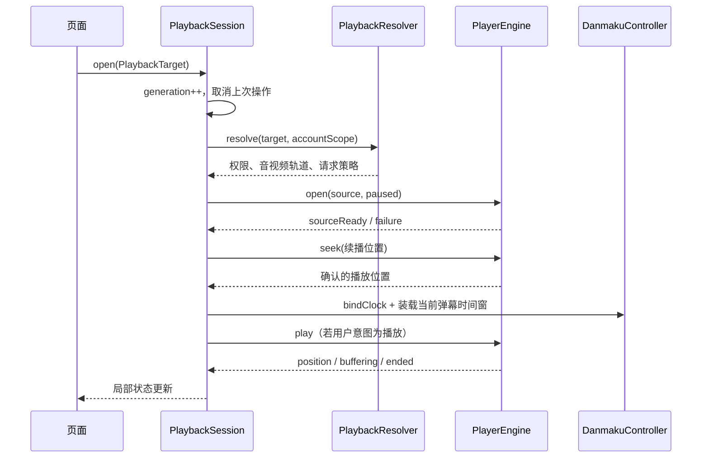
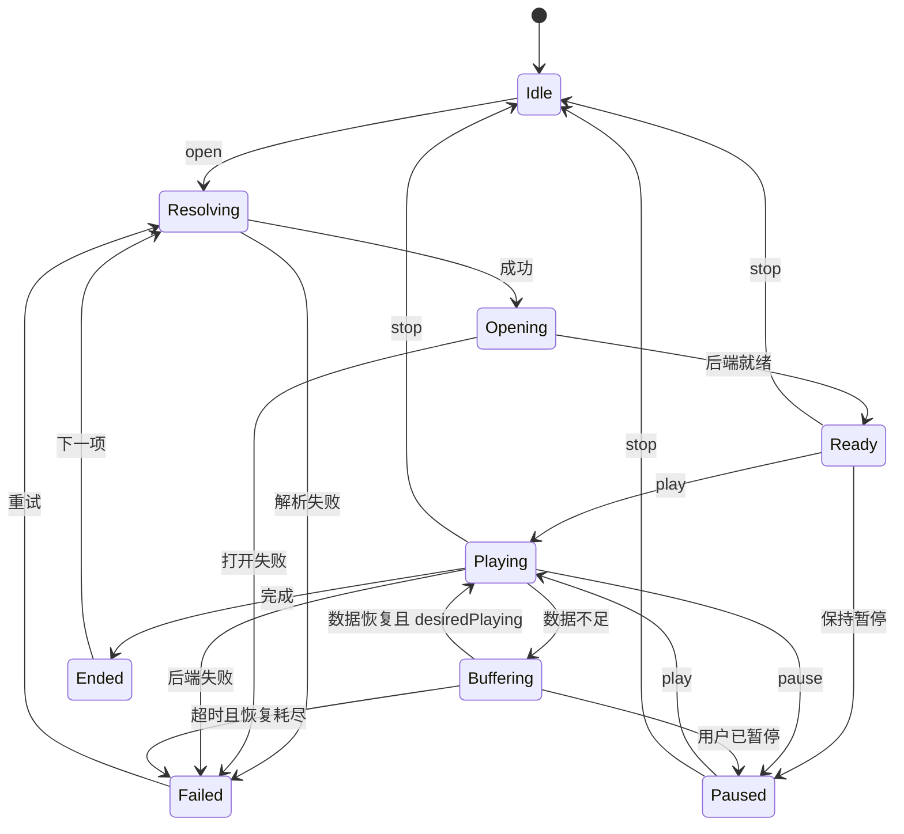

# 播放、直播与弹幕设计

日期：2026-10-05。首版已使用 `media_kit`，Windows 分轨与请求策略已验证，三端结论仍以完整 M0 为准。本文中的参数为初始预算，不是已测结果；当前证据见 [实测记录](validation/m0-results.md)。

影视弹幕、直播实时连接/画面弹幕及 SC 状态合并的当前实现和容量限制见 [影视与直播弹幕修复](validation/pgc-live-danmaku.md)；直播使用独立到达时间时钟，继续复用唯一原生播放会话。

2026-10-06 点播已接入云端进度上报；开启记住进度时本地记录优先，仅在本地缺失时读取当前分 P 的云端进度。Web 会话、队列/账号/源隔离及验证边界见 [云端播放进度](validation/cloud-playback-progress.md)。

2026-10-06 点播倍速增加应用运行期间的内存记录：播放页菜单/快捷键修改后，新视频、分 P 与影视剧集继承最近成功选择的倍速；重启应用使用设置默认值。已有源恢复保留自己的倍速，长按临时加速与直播不写入记录，见 [应用会话内继承倍速](validation/session-playback-rate.md)。

## 1. 四个独立职责

2026-10-06 增加视频 CDN 偏好：默认保留接口调度，其他选项只排序服务端提供的 URL，不重写签名地址或 IP；普通视频、影视与临时悬停播放器共用轨道排序，直播线路独立。悬停打开采用 8 秒预算和一次备用尝试，恢复前台／工作区时重新检查悬停；边界与实测见 [CDN 与悬停恢复](validation/video-cdn.md)。

同日官网加载对照后，悬停改为独立 `DashVideoSource` 无音轨预览，自动模式优先服务端常规 CDN，每地址外层/原生统一 3 秒、最多三个地址；有效 cid 直传。普通点播/影视继续验证音视频分轨，预览不作为完整点播验收；现行预览策略与原因见 [悬停加载验证](validation/video-preview-loading.md)，覆盖上段早期策略。

2026-10-07 所有播放器打开默认采用最多 5 分钟媒体时间的向前预读窗口，悬停预览继续显式采用 5 秒（由最初的 15 秒按用户要求缩短）。`OpenOptions.maxBufferAhead` 必须大于 0 且不超过 5 分钟；适配器在打开媒体之前设置 `cache-secs` 和 `demuxer-readahead-secs`，关闭临时磁盘缓存，保留 SDK 的内存字节限额。窗口随当前位置推进，不截断视频或限制总播放时长；原生分包、解码和网络 I/O 边界有少量超出，内存配额也可能让预读早于 5 分钟停止。普通播放实现与 Windows 证据见 [播放器预读窗口](validation/player-buffer-ahead.md)，预览另见 [悬停加载验证](validation/video-preview-loading.md#5-秒向前预读窗口)。

| 组件 | 所属位置 | 职责 |
| --- | --- | --- |
| PlaybackResolver | 主应用 playback/application，依赖内容 Repository | bvid/cid/episode/roomId → 权限、可选轨道、URL 与请求上下文 |
| PlaybackSession | 主应用 playback/application | 会话、命令串行化、错误恢复、续播、播放队列、进度上报 |
| PlayerEngine | `packages/bili_player` | 通用媒体源打开、解码、音视频同步、seek、事件和 native 资源 |
| DanmakuController | `packages/bili_danmaku`，由会话注入数据与时钟 | 事件调度、轨道、过滤、布局、绘制；无 API 依赖 |

视频解码在原生后端内进行，不把每帧图像通过 Dart/Rust 来回传递。Flutter 在视频 surface 之上绘制弹幕、字幕和控制层；高频重绘局限在对应层。

2026-10-07 Windows 悬停崩溃转储确认 mpv 核心销毁时渲染上下文仍存在。Windows 构建现在对锁定的 `media_kit_video 2.0.1` 应用可校验补丁：方法通道的 Dispose 回复必须晚于纹理注销、渲染队列排空和渲染上下文释放，随后才允许依赖销毁 mpv 核心。主应用接口不变，补丁来源、顺序约束与未实机验收范围见 [Windows 悬停预览销毁崩溃](validation/windows-preview-dispose.md)。

`media_kit` 文档列出了三端、外部音轨、字幕和 HTTP headers 等能力，适合作为首选；这些能力组合后的行为仍需项目验证。[media_kit](https://pub.dev/packages/media_kit)

## 2. 通用播放契约

以下为完整目标契约示意；实际公共接口见 `packages/bili_player/lib/bili_player.dart`，现有 DASH/progressive 和 manifest 源；Windows 已验证点播分轨、直播 HLS/FLV。字幕由应用解析并叠加，尚未开放 native 字幕选择和离线源。本轮三类页面及未测项见 [影视与直播内置播放](validation/content-playback.md)：

```dart
abstract interface class PlayerEngine {
  Stream<PlaybackSnapshot> get snapshots;
  Stream<PlayerFailure> get failures;
  PlayerCapabilities get capabilities;
  Future<void> open(ResolvedMediaSource source, OpenOptions options);
  Future<void> play();
  Future<void> pause();
  Future<void> seek(Duration target);
  Future<void> setRate(double rate);
  Future<void> setVolume(double volume);
  Future<void> selectAudioTrack(String trackId);
  Future<void> selectSubtitle(String? trackId);
  Future<void> stop();
  Future<void> dispose();
}
```

- `ResolvedMediaSource` 是 `ProgressiveSource / DashPairSource / ManifestSource / LiveSource / LocalSource` 联合类型，不能用一个裸 URL 表示全部播放形态。
- `DashPairSource` 包含独立视频/音频轨道、codec、码率、分辨率、duration、备用 URL、过期信息及各自的请求策略；无音轨必须区分合法无声视频和解析失败。
- `MediaRequestPolicy` 含允许的目标来源、UA/Referer 等实际所需头、重定向规则。凭据只在会话内存中短期存在；不作为可打印的模型字段暴露给 UI。
- `PlaybackSnapshot` 含 phase、position、duration、buffered、seekable、rate、轨道和播放意图；禁止 UI 直接操作 `media_kit.Player`。
- `PlayerCapabilities` 表示实际可用的外部音轨、字幕、codec/容器、截图等；系统 PiP/媒体键属于 PlatformServices，不能混为后端能力。
- `VideoSurface` 是 bili_player 的 Flutter UI 出口；核心控制契约和 UI surface 分文件，测试可用 FakePlayerEngine。

从用户偏好、服务端授权的 representation、后端支持和当前设备能力的交集选轨。优先使用经过验证的 H.264/AAC 组合；HEVC/AV1、HDR、高帧率逐项测试，不仅凭 codec 名宣称硬解成功。

当前设置已提供 H.264/HEVC/AV1 点播编码偏好，以及三类播放共用的自动/软件解码方式。默认 H.264 和 SDK 自动模式；同清晰度优先匹配编码，缺失时使用其他已识别编码。源 generation 捕获偏好，下次打开/重新加载时应用；软件解码保持 GPU 渲染开启。具体选择顺序、SDK 差异和 Windows/其他平台验证边界见 [视频编解码设置](validation/video-codec-settings.md)。

## 3. DASH 分轨处理

Bilibili playurl 的 DASH 响应通常提供 representation 信息而非可以直接播放的完整 MPD。**播放器能打开 MP4 URL，不等于已经实现带独立音轨的 Bilibili 播放。**

首选路径：`DashPairSource → MediaKitEngine`，在暂停状态装载视频与外部音轨，确认轨道与目标进度准备好后统一播放。必须验证外部音轨是否获得需要的 headers、seek 同步和换轨行为，不能用两个互不关联的 Player 分别播放音视频。

若首选不满足三端需求，再在适配层评估完整 MPD：从实际返回的 codec、timescale、init/index range、duration 等构造，不凭空填写；优先会话临时文件。只有后端确实需要时才加入本地 loopback 服务，绑定回环地址、随机端口和会话 token，正确处理 Range、Content-Type、清理与访问边界。首版不默认引入本地代理。

如果两条路径都失败，使用相同契约验证 `fvp`；它基于 libmdk，提供额外后端 API，但仍须验证分轨请求头和许可/打包依赖。[fvp 文档](https://pub.dev/packages/fvp)

### 点播打开流程



`open` 成功含义是后端已接受源并可继续定位，不以“HTTP 已返回”代替首帧。`sourceReady`、seek 完成和首帧分别记录指标。

### 清晰度、换源与恢复

1. 保存确认的 position、pause/play 意图、rate、音量和字幕选择，提升 source generation。
2. 解析当前允许的轨道；以用户偏好筛选可用结果，不能申请未授予的权益。
3. 暂停并重新打开成对轨道，定位到有效位置，再恢复用户意图；MVP 允许短暂缓冲，不承诺无缝换清晰度。
4. 刷新弹幕定位点，丢弃旧后端事件。失败时若旧源仍有效，可尝试恢复一次并清楚提示。

CDN 故障先尝试响应中同一轨道的备用 URL；疑似过期则刷新 playurl，再尝试一次。对每次打开设统一恢复预算，默认最多 3 次后端重开，包含换 CDN、刷新 URL 和 codec 降级，避免各层重试相乘。

软解导致持续掉帧/高负载时，允许建议切到较低分辨率或已验证 codec。错误恢复不能无提示改变用户账号、内容、付费权限或全局清晰度设置。

## 4. 播放状态与所有权

采用一个播放 phase 加正交字段 `desiredPlaying / isSeeking / screenMode`，避免把全屏、暂停、缓冲拼成大量组合状态。



公共约束补充：所有活动状态都可 `stop → Idle` 或 `dispose → Disposed`；所有未完成步骤可失败或取消。新 open 从任意非 Disposed 状态进入 Resolving，旧任务作废。状态图展示主路径，不是允许事件的完整代码表；实现时以表驱动测试补齐。

- 命令按会话串行处理，拖动 seek 合并到最后目标，不积压每个拖动事件。
- `seek` 后等待后端确认再重建弹幕时间基线；不能用请求位置冒充已播放位置。
- 切全屏/窗口/布局只改变 surface 的布局和系统状态，不创建第二个音视频播放实例。
- 移动全屏按当前源的已解码显示尺寸选择方向，包含像素宽高比与旋转元数据修正：横向画面横屏，纵向／正方形画面竖屏；尺寸晚到或全屏换源时更新方向，退出／隐藏／关闭后恢复系统默认策略。尺寸与方向命令均隔离旧源和旧全屏 owner，具体平台边界见 [移动全屏方向验证](validation/responsive-player.md)。
- 页面订阅销毁与会话销毁分开；播放页关闭时默认停止，应用内小窗启用时显式转交给 PlaybackManager。
- 每个播放标签拥有独立的 `PlaybackSession` 和 engine，同一标签换 P、选集、清晰度或线路仍替换该会话内的源。“允许多个标签页同时播放”默认开启，仅在多标签模式生效；满足条件时打开新播放页不停止旧视频，隐藏只移除 surface、绘制与输入。单标签或关闭开关时，由 `PlaybackManager` 先暂停旧会话，再放行新会话，许可同样约束迟到解析和排队播放命令。设置立即生效，关闭并发时保留当前／最近选择的播放标签。导航暂停保留原源、进度和用户意图；返回或恢复允许并发时继续，手动暂停保持暂停。切到普通页面保留最近播放会话；关闭标签只释放自己的会话，账号变化与退出清理全部会话。移动系统后台暂停按各媒体 owner 执行，不能把应用内隐藏等同于系统后台音频支持。验证见 [多标签并发播放](validation/multi-tab-playback.md)。
- 暂停、缓冲、后台策略变化都同步通知弹幕时钟；后台恢复不得自动抢占已被其他应用取得的音频焦点。

## 5. 点播弹幕与字幕

### 数据管线

`DanmakuRepository → HTTP Protobuf → 有界解码任务 → 标准事件 → 过滤/排序 → 预取时间窗 → 轨道调度 → Painter`。

登录后的密集分段可能包含超过 6000 项；当前解码器完整验证响应并将超量分段均匀抽样至最多 6000 条普通弹幕，不将条数超预算直接视为协议失败。字节和单项限制、取消与 isolate 预算继续生效；首集对照及选集子标签交互见 [密集番剧弹幕与选集子标签](validation/pgc-dense-danmaku.md)。

`DanmakuEvent` 包含 string ID、毫秒时间、文本、模式、颜色、字号、必要的屏蔽标识。大批解码/筛选在 isolate；TextPainter 和绘制留在 Flutter UI isolate。一次传一批数据，不为每条弹幕跨 isolate/FFI 调用。

分段长度、分段总数按元信息和已验证协议解释，配置中可使用经验证的 6 分钟策略，但不能把 `total` 当作秒数或假定所有内容相同。只获取当前段和有限相邻段，初始窗口为当前段、后 1 段与前 1 段；缓存容量另有总配额。快速 seek 取消远处请求并提高 generation，按 ID 去重。

### 时钟

点播唯一业务时间源是 PlayerEngine 的确认位置，用于加载分段和决定弹幕何时出现。Ticker 的单调时间在两个位置样本间插值媒体位置：

```text
estimatedPosition = anchorPosition + (monotonicNow - anchorTime) × playbackRate
```

弹幕滚动、固定项停留与轨道占用使用独立的动画时间，累积可播放阶段的单调时间差，不乘播放倍速。播放倍速只影响媒体位置和触发节奏；滚动速度仍由独立弹幕速度设置控制。收到新 position 或调整倍速时先结算旧动画时间，再更新媒体 anchor，保留活动弹幕的滚动进度。

两个时钟都只在确认 Playing 且未 buffering/seeking 时前推；位置样本超过 700ms 未更新时冻结，避免后端已停而弹幕继续跑。暂停/缓冲冻结，seek 清空活动项并从目标时间附近二分检索重建；历史事件的媒体年龄按当前倍速换算为动画年龄，回看范围同时覆盖仍可见的项。回退 seek 允许弹幕再次出现；已调度 ID 只保留在有界当前时间窗，正常刷新不会重播已丢弃或过期的项。实现和测试边界见 [弹幕速度与播放倍速](validation/danmaku-playback-rate.md)。

### 渲染与轨道

现有播放器与全局设置已共用弹幕配置入口，支持独立字体、加粗、阴影/描边/无效果、时间偏移、重复合并、同屏密度、权重/颜色/本地关键词过滤。点播按偏移后的时间调度，直播只允许消息延后；权重过滤仅适用于点播。具体默认值、范围、持久化与未测项见 [弹幕配置验证](validation/danmaku-style-settings.md)。

- 基础实现使用 `CustomPainter`、`TextPainter`、`RepaintBoundary`，单一 Ticker；不为每条弹幕创建动画 Widget。
- 支持右到左滚动、顶部固定、底部固定；轨道高度受字号/行高影响，字幕安全区和控制区预留。
- 弹幕行距表示文字布局之间的空白，范围 0–100 逻辑像素，默认 5，0 时紧挨着；轨道高度为最大文字布局高度加设置行距。两处设置入口与点播／直播接入见 [弹幕行距](validation/danmaku-line-spacing.md)。
- 滚动轨道考虑前项的尾部、后项速度及追尾时间，不能只检查初始间距；固定弹幕按显示区间占位。
- 点播全屏、窗口尺寸和控件避让变化保留活动弹幕的时间进度与调度游标，只移除超出可用轨道的项；不能清空后重放已丢弃的历史弹幕。零尺寸过渡不消耗调度项，实际 seek 仍按确认位置重建，验证见 [全屏弹幕保留](validation/danmaku-fullscreen.md)。
- 初始上限 120 条同时可见、500 条待调度；不足时优先保持播放流畅，按密度规则丢弃/抽样，不无限排队。
- 字形/段落布局使用含文本、字体、字号、缩放、描边的有界 LRU；用户改字体时失效相应布局，单行弹幕的文字布局不依赖窗口宽度，尺寸变化沿用缓存。
- 降级顺序：减密度 → 简化描边/阴影 → 限制字体尺寸与轨道；是否进一步降帧要实测，不能拖慢视频控件。
- 支持按模式、关键词和用户规则过滤；任意用户正则可能阻塞，MVP 先提供字面关键词/类型过滤，后续正则需限制执行成本。
- 特效、脚本、高级定位弹幕不在 MVP，未知模式可跳过并计数，不执行内容中的代码。

已有 Flutter 弹幕库只有在“暂停/seek/倍速一致性、Canvas 开销、内存上限、三端字体和许可”均通过后才替换 Painter；保持公共事件/时钟契约。

字幕统一为 cue 列表，与确认播放时间同步。优先在独立 Flutter 层绘制基础文本以控制样式和避让；后续需 ASS 等格式时可使用后端字幕能力，但同一轨道不双重渲染。把 Bilibili JSON 字幕转为 cue 或受支持文本格式，不能把 JSON URL 直接当 SRT。

### 5.1 章节时间轴与预览

普通视频已实现章节分段进度与悬停缩略图：章节和字幕元数据合并读取，雪碧图索引首次悬停才加载；预览保留局部状态、播放源/账号隔离和有界图片缓存，不 seek 或创建第二个播放器。标题按片段可用宽度显示，完整入口保留在章节菜单。协议、生命周期、真实样本与平台边界见 [视频章节与悬停缩略图](validation/playback-timeline.md)。

列表视频卡另使用真实视频悬停播放：复用 Web/WBI 点播源接口请求低清晰度，通过独立、静音的临时 PlayerEngine/VideoSurface 播放。预览不属于正式播放标签，不访问进度存储或上报；进程级管理器最多保留一个预览，切换前等待释放，离开/隐藏/后台/账号转换均取消。网页实际请求、容量与原生验证见 [视频卡悬停播放](validation/video-card-hover.md)。

## 6. 直播媒体与消息

直播使用同一个 PlayerEngine，但独立 `LivePlaybackPolicy`：选择服务端提供且后端可播的 HLS/HTTP-FLV 等组合；协议、容器、codec、线路是不同维度。M0 同时验证 HLS 与 HTTP-FLV，正式默认选通过验证且稳定的线路组合。

直播不复用点播的续播位置、完播和分 P 逻辑；默认不可 seek，除非服务端明确提供回看窗口。重连后追直播边缘，不 seek 到断线前的时间。缓冲长度作为播放策略配置，先保证稳定，再测延迟。

`LiveChatSession` 的状态：Idle → FetchingConnectionInfo → Connecting → Authenticating → Connected → Backoff / Offline / Closed。

- 每次连接取当前 roomId、token 和候选 host，不能永久硬编码单一 WS 地址。
- 使用完整 packet length/header length/version/operation/sequence 校验。正确处理单 message 内的多个包与解压后的嵌套包；库若暴露帧，则先按其 API 聚合完整 message。
- 实现并验证 raw/zlib；Brotli 必须有解码器和 fixture 后才声明协议版本 3，不能广告不支持的压缩。未知版本形成可诊断失败或已验证的协议降级。
- 初始限制单包 1 MiB、单批解压 8 MiB、嵌套 4 层，超限丢弃并受控重连；这些阈值由正常直播样本验证调整。
- 鉴权成功后按已验证协议发送心跳（初始按 30 秒验证），超时或无响应判定失联；重连指数退避+抖动，上限 30 秒，连续 5 次失败后进入需要用户重试的状态。
- 切房间、退出、后台策略变更都会停止心跳、定时器和重连任务。恢复网络先重新获取连接信息，避免沿用过期 token。
- 解析、聊天列表和屏幕弹幕使用独立有界队列。状态/鉴权消息优先，普通聊天超限丢最旧；初始聊天列表保留 500 条，UI 批量更新。
- 直播弹幕基于收到消息的单调时间调度，视频缓存造成的延迟仅允许用户偏移；服务端未提供可靠映射时不声称逐帧同步。重连不重播积压弹幕。

媒体断线与消息断线独立恢复：聊天室暂时断开不能停视频；视频缓冲也不能无限堆积弹幕。房间已下播进入明确 Offline 状态，不持续刷播放 URL。

## 7. 下载与离线扩展

M4 复用 PlaybackResolver 的轨道选择，下载走独立 `TransferEngine`；不通过录屏或实时转码完成下载。

任务状态：Queued → Resolving → Downloading → Verifying → Completed；中间可 Paused/Failed/Cancelled。下载器属于进程级服务，不绑定下载页生命周期。初始并发 2 个任务、每任务至多 2 个传输，播放出现带宽压力时降低下载并发。

记录内容标识、账号 scope、轨道 representation/codec、已完成 ranges、总大小、ETag/Last-Modified（如有）、文件相对路径。URL 过期重新解析同一资源；必须确认新内容与原部分文件可拼接，否则重下该轨道。

断点续传验证 `206 + Content-Range`、长度和校验信息；收到 200 时不能追加整个文件，416 时核对大小而非直接标记成功。先写临时文件，验证后原子改名并事务提交索引；崩溃恢复能处理“文件完成但数据库未提交”的中间状态。

离线 manifest 带 schema、contentId/cid、相对轨道路径、时长、大小/校验及字幕/弹幕。M4 首版先直接播放本地分轨，合并导出延后到有明确需求时。离线文件不是普通缓存，清缓存不删除它。

Android 初期只承诺前台下载与重启恢复；后台持续下载必须另做系统服务和权限验证。macOS 目录授权、Windows 文件占用、磁盘不足、跨盘移动、取消清理都需要平台测试。

## 8. 后端验收与诊断

M0 必测：三端带真实请求头的分轨音视频、暂停/seek/倍速、音画同步、前后台、全屏、线路失效、HLS/FLV、密集弹幕以及 30 分钟持续播放。

记录首帧、seek 到恢复画面、buffering 时长、backend error、视频 dropped frames（后端提供时）、Flutter UI/raster 帧耗时、CPU/GPU/内存。Flutter 帧率与视频解码掉帧是两个指标，不能互相代替。

不假设单个基准能证明全部硬解/codec 可用。播放器失败记录阶段和错误分类，对媒体 URL、native 日志和 headers 脱敏。量化预算及验证记录格式见 [实施与验收](implementation-plan.md)。
