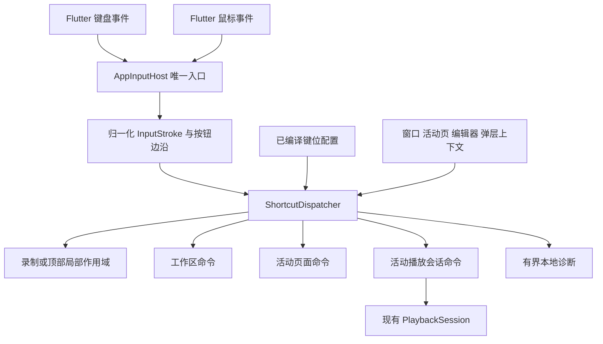
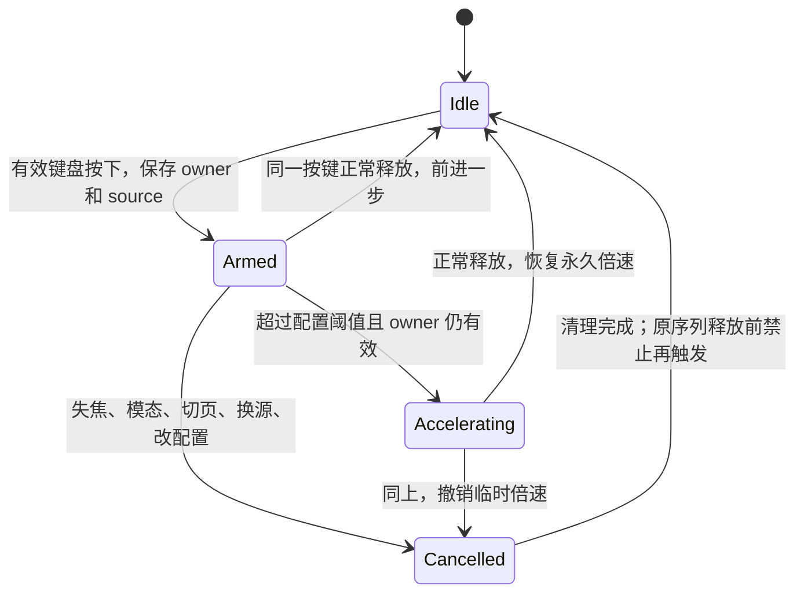

# 快捷键体系重构方案

日期：2026-10-07。状态：**运行期重构已实施，真实键鼠及跨平台实机验收待完成**。

本文第 2 节保留实施前的源码基线和问题证据，其余章节为设计约束。当前结构、自动验证与未测项见[实施记录](implementation-results.md)。

本方案以当前工作区源码为基线，目标是保留现有快捷键功能，统一键盘、鼠标侧键、页面与播放器的分发规则，解决反复依赖局部焦点补丁的问题。设计阶段只整理方案；随后已按用户要求实施运行期重构。用户反馈的物理侧键与输入法间歇失效仍须真实输入轨迹验收。

关联：[整体架构](../architecture.md)、[播放设计](../playback-and-danmaku.md)、[实施与验收](../implementation-plan.md)、[既有快捷键记录](../validation/shortcuts-rich-comments.md)、[焦点修正记录](../validation/keyboard-feedback-focus.md)、[侧键与设置](../validation/settings-tabs-fonts.md)。历史文档描述的是各轮状态；本文的现状判断以 2026-10-07 源码为准。

## 1. 建议采用的方案

采用 **应用级单一输入入口 + 确定顺序的命令分发器 + 显式作用域 + 页面能力注册**。

- 应用窗口只保留一处业务键盘提前监听、一处鼠标全局路由。页面、播放器和录制窗口不再各自监听同一组应用命令。
- 输入识别、键位匹配、作用域判断、命令执行分开。事件是否到达、为什么未匹配、被什么规则阻止、交给哪个页面，都有可检查的结果。
- 工作区管理新建、关闭、切换标签；活动页面管理刷新、分 P／选集、信息栏；活动播放会话管理媒体操作。焦点位置不用于猜测当前播放目标。
- 文本编辑、模态窗口、快捷键录制和全屏分别建模。全屏是当前播放页的展示方式，不能仅因使用 DialogRoute 就与普通弹窗同等屏蔽。
- 长按、重复、取消与异步结果有明确生命周期。普通／全屏视图重建不再创建另一套快捷键所有者。
- 保留原键位、多个别名、组合键、鼠标侧键、开关、解除绑定、冲突检测、恢复默认和播放参数。首轮不增加第三方快捷键依赖，不重写 PlayerEngine，不接入系统全局热键。

“应用级”只指当前应用窗口内。应用失焦后不控制其他窗口，也不把后台仍在播放的标签当作快捷键目标。

## 2. 当前实现及问题证据

### 2.1 输入与执行分布

| 当前文件 | 已有职责 | 重构时需要消除的分散点 |
| --- | --- | --- |
| [keyboard_shortcuts.dart](../../lib/core/presentation/keyboard_shortcuts.dart) | 字符串键名、修饰键、标点物理键回退、侧键解析、Expando 去重、输入／路由保护 | 识别、消费与上下文保护混在一起；只返回字符串／布尔值，丢失未处理原因 |
| [shell.dart](../../lib/app/shell.dart) | early key handler 处理新建／关闭，命中树 Listener 处理侧键，CallbackShortcuts 切换标签 | 三种入口；关闭编辑器的例外规则在外壳单独判断 |
| [router.dart](../../lib/app/router.dart) | Focus 与鼠标 Listener 处理各类页面刷新 | 依赖焦点／鼠标命中；与播放器刷新并存 |
| [playback_panel.dart](../../lib/features/playback/presentation/playback_panel.dart) | 每个 `_PlayerView` 注册 early handler、全局 pointer route；处理媒体命令、部分页面命令及长按 | 视图持有输入入口与长按状态；普通／全屏视图重新注册；媒体与页面命令混合 |
| [video_screen.dart](../../lib/features/video/presentation/video_screen.dart) | Focus 与鼠标 Listener 处理信息栏、前后分 P | 播放器通过 `PlaybackPageCommands` 也可执行这些动作 |
| [pgc_screen.dart](../../lib/features/pgc/presentation/pgc_screen.dart) | 自己处理刷新；提供前后选集、信息栏回调 | 刷新与播放器 `session.retry()` 语义不同 |
| [shortcut_settings.dart](../../lib/features/settings/domain/shortcut_settings.dart) | 20 个动作、默认键位、字符串配置、解析与冲突检查 | 命令身份归属设置功能；运行期只做字符串匹配 |
| [shortcut_settings_section.dart](../../lib/features/settings/presentation/shortcut_settings_section.dart) | 设置表单及嵌套录制弹窗 | 录制另走 Focus／鼠标 Listener；鼠标需要放到指定区域 |
| [image_viewer.dart](../../lib/shared/ui/image_viewer.dart) | 模态图片查看器的关闭、翻页、缩放 | 属于已有局部快捷键，迁移时也必须保留 |

### 2.2 已确认的结构性问题

1. **多个 early handler 并不是互斥命令链。** 当前外壳和播放器都调用 `addEarlyKeyEventHandler`。Flutter 会调用所有提前监听器，再合并结果；其中一个返回 handled，只阻止后续焦点树处理，不阻止其他提前监听器。不能把注册顺序作为命令优先级，也不能将 handled 理解为全局唯一执行保证。[Flutter 官方说明](https://api.flutter.dev/flutter/widgets/FocusManager/addEarlyKeyEventHandler.html)
2. **鼠标入口不一致。** 工作区依赖命中树 Listener，播放器依赖全局 pointer route，录制依赖弹窗内容区域。`Expando` 只保证某个原始 PointerEvent 在这些业务监听间不重复执行，不能统一命中范围、模态规则，也不能补回未送达 Flutter 的事件。
3. **侧键识别过于依赖事件形态。** `mouseShortcutKey` 只接受 `PointerDownEvent`，且 `buttons` 必须精确等于某一个侧键位。组合鼠标按钮明确不匹配；其他事件中的按钮变化没有建模。这是已确认的支持边界，是否就是本次间歇失效的原因仍需真实轨迹。
4. **刷新存在多个执行定义。** 播放器收到刷新执行 `session.retry()`；路由层对 UGC 还失效相关推荐／标签，对直播重新加载房间；PGC 页面另行加载剧集数据。键盘提前处理与鼠标命中路径可能选择不同的刷新对象。
5. **上下文保护依赖调用者的 BuildContext。** `shortcutsBlocked` 检查调用点 `ModalRoute.isCurrent` 和当前 EditableText，关闭侧键又在 shell 增加例外。同一按键的待遇由接收组件决定；全屏使用 root `RawDialogRoute`，进一步改变底层路由的 isCurrent。
6. **部分规则绕过设置体系。** `Ctrl+Tab`／`Ctrl+Shift+Tab` 为外壳固定快捷键，不经过总开关和动作表；Space／Enter 是否交给控件由播放器另行判断。设置说明“文本输入和弹窗期间不触发”已经不能完整解释关闭标签的例外。
7. **识别成功不等于命令效果正确。** 倍速每次从当前 snapshot 推算下一档，而音量已有待提交目标值累积。如果多次离散按键到达时 snapshot 尚未更新，倍速有重复计算同一目标档位的风险；这需要延迟引擎测试验证，不能直接认定为标点失效的根因。

本机已核对 Flutter **3.47.6 / Dart 3.13.5**，framework revision 为 `5fc346839b5d0eef006ed8404392afb4dfae428d`。SDK 的 `packages/flutter/lib/src/widgets/focus_manager.dart` 中 `handleKeyMessage` 与上述提前监听语义一致；该版本在 primaryFocus 为空时也会直接返回。因此新入口仍需维护正常根 FocusScope，不能承诺只换一个监听器就消除所有窗口焦点问题。

### 2.3 两个用户反馈的取证边界

| 反馈 | 当前代码已有措施 | 仍待确认 | 重构中的处理 |
| --- | --- | --- | --- |
| 鼠标侧键关闭标签时灵时不灵 | 关闭侧键允许越过编辑器保护；原始指针事件去重；固定首页保护 | 失败时事件是否到达、buttons 是否变化、是否处于全屏／弹窗／原生视图、驱动是否改发键盘或系统命令 | 单一 pointer 入口、按钮边沿状态、显式关闭规则、目标冻结、真实鼠标验收 |
| `;`／`'` 调整倍速经常失效 | Semicolon、Quote、quoteSingle 逻辑识别；两个标点的物理键回退；F1/F2 别名 | 输入法是否交付事件、逻辑／物理键差异、残留修饰键、编辑器焦点、源代次和原生倍速执行结果 | 共用录制／执行归一化、精确修饰键、受限标点回退、分层诊断、异步命令验收 |

本轮没有操作真实鼠标、切换真实输入法或启动发布包复现。既有注入事件测试只证明相应 Flutter 事件进入后的行为，不能证明 Windows 驱动／IME 的原始输入链完整。先补可观测证据，再决定是否需要小型原生适配；不直接添加全局键盘 Hook 或用固定延迟掩盖问题。

## 3. 必须保留的功能清单

### 3.1 20 个可配置动作

下表以当前 `ShortcutAction` 为准。一次表示一个真实按下序列只执行一次；除有明确连续语义的动作外，重复事件被消费但不重复执行。

| 动作 ID | 默认键位 | 执行所有者与保留语义 | 重复策略 |
| --- | --- | --- | --- |
| `playPause` | Space | 当前播放器播放／暂停；错误态沿用重试入口 | 一次 |
| `fullscreen` | F、F11、Enter | 当前播放页切换全屏，保持同一个 PlaybackSession／engine | 一次 |
| `exitFullscreen` | Escape | 退出当前全屏；普通页面不执行 | 一次 |
| `fullWindow` | W、F12 | UGC／PGC 收起或展开信息栏；全屏时先退出再执行对应页面动作 | 一次 |
| `seekBack` | ArrowLeft | 按配置步长后退，默认 3 秒 | 按下及系统重复 |
| `seekForward` | ArrowRight | 键盘短按释放后前进；长按临时倍速；鼠标绑定为按下时前进一次 | 长按状态机 |
| `seekLarge` | O、P | 前进 90 秒 | 一次 |
| `volumeUp` | ArrowUp | 音量 +5，限制到 100，并显示反馈 | 按下及系统重复 |
| `volumeDown` | ArrowDown | 音量 -5，限制到 0，并显示反馈 | 按下及系统重复 |
| `mute` | 无 | 保留可绑定能力，静音／恢复先前非零音量并显示反馈 | 一次 |
| `danmaku` | D、F9 | 已有点播弹幕显示开关，复用现有设置回调 | 一次 |
| `subtitles` | F6 | 开启首条可用字幕／关闭字幕 | 一次 |
| `slower` | F1、Semicolon（`;`） | 降低一个固定倍速档位，并显示反馈 | 一次 |
| `faster` | F2、Quote（`'`） | 提高一个固定倍速档位，并显示反馈 | 一次 |
| `toggleRate` | Ctrl+1 | 当前速度为 1x 时设为 2x，否则设为 1x | 一次 |
| `previousPart` | Z、N、Comma | UGC 上一分 P／PGC 上一集，继续调用现有页面回调 | 一次 |
| `nextPart` | X、M、Period | UGC 下一分 P／PGC 下一集，保留现有队列／选集规则 | 一次 |
| `newTab` | Ctrl+T | 多标签新建浏览页；单标签不新建；保留 16 页上限提示 | 一次 |
| `closeTab` | Ctrl+W | 多标签关闭当前非固定页；单标签按现有访问历史返回 | 一次 |
| `refresh` | Ctrl+R、F5 | 统一交给活动页面的刷新能力，详见第 6 节 | 一次；进行中合并 |

所有动作继续允许现有支持的 Ctrl／Alt／Shift／Meta 组合、多个键位别名、`MouseBack`／`MouseForward` 绑定，包括带键盘修饰键的侧键。左右 Ctrl 等按现有规则合并，不把 CapsLock／NumLock 作为组合修饰键。

倍速固定集合为 **0.5、0.75、1、1.25、1.5、2、3x**，边界不越界。前后步长 1–90 秒；长按延迟 200–1500 毫秒，默认 400；临时倍速使用现有大于 1x 的档位，默认 3x。手动永久倍速继续遵守[应用会话内继承规则](../validation/session-playback-rate.md)，临时倍速不写入共享记录。

### 3.2 表外也必须保留的交互

| 交互 | 处理方式 |
| --- | --- |
| Ctrl+Tab／Ctrl+Shift+Tab | 仍为固定保留的标签循环命令，保留按下及系统重复循环，保持独立于可配置快捷键总开关；单标签不循环。纳入同一个分发器和弹窗规则，不再挂独立 CallbackShortcuts |
| 图片查看器 | 保留 Esc 关闭；←／PageUp 上一张；→／PageDown 下一张；↑／Equal／数字键盘加号放大；↓／Minus／数字键盘减号缩小；翻页／缩放允许重复，关闭只执行一次 |
| 图片 Ctrl+滚轮缩放、拖动，应用滚轮与焦点导航 | 保留局部手势及 Flutter 控件原生语义，不转换为新的应用命令 |
| 搜索／评论／弹幕／私信等编辑器 | 保留输入、选择、复制粘贴、IME 候选与控件已有提交规则；不新增自动发送行为 |
| 普通按钮与列表 | 保留 Tab 焦点遍历、Enter／Space 激活；未绑定／禁用的播放器键继续交给控件 |
| 视频控制栏显隐 | 继续只由已有画面点击等明确入口控制；快捷键与鼠标移动不改变显隐意图 |
| Android 返回、窗口系统关闭 | 保留既有导航／系统入口，不擅自转换为新的快捷键绑定 |

macOS 首轮保留现有 Ctrl 默认值与 Meta 自定义能力，不静默将 Ctrl 替换成 Command。平台惯例优化可以另作产品调整。

当前直播快捷键支持播放、音量、静音、全屏、刷新；播放器明确拒绝点播 seek、倍速、字幕和 `danmaku` 动作，直播也没有前后分 P／信息栏目标。重构先保留这些真实边界，不因界面存在直播弹幕就宣称其快捷键已经可用。离线播放保留共享面板已有的媒体能力；未注册的前后分 P／信息栏保持不可用。

截图、小窗、重启、开发模式以及 Ctrl+S 下载不在本轮新增范围。下载功能已经存在，但下载快捷键尚未接入，不能沿用历史文档“没有下载能力”的说法。

## 4. 分层与状态所有者



### 4.1 组件职责

| 组件 | 职责 | 不持有的内容 |
| --- | --- | --- |
| `AppInputHost` | 挂载／释放唯一键盘 early handler 和全局 pointer route；观察窗口焦点、应用生命周期、根焦点；将 Flutter 类型转成输入事件 | 页面业务、播放器状态、持久化 |
| `InputNormalizer` | 按键身份、修饰键快照、按下／重复／释放／取消、标点回退、鼠标按钮变化 | 当前标签、动作回调 |
| `ShortcutDispatcher` | 纯 Dart 决策：配置匹配、上下文过滤、固定顺序选择唯一目标、按下序列占用、结果分类 | Flutter Context、Riverpod、网络、media_kit |
| `ShortcutCoordinator` | app 组合根组装配置、活动 tab、窗口与 route 信息、目标注册表；更新 context revision | 不另建播放会话，不逐帧订阅 position |
| `CommandTarget` 注册 | 用明确命令集合、能力与 owner 标识暴露已有回调；注销句柄负责释放 | 不自行解析键盘／鼠标 |
| `PlaybackShortcutController` | 每个播放 owner 的媒体命令、长按生命周期；调用现有 PlaybackSession；向展示层输出结果 | 不监听全局硬件，不依赖另一个 Feature 的 presentation |
| 设置与录制界面 | 展示统一命令目录、校验并保存配置；申请最高优先级录制作用域 | 不执行已录到的命令 |

输入、组合键、调度器放在 `core` 的通用类型不包含 `ShortcutAction` 等业务枚举；调度器以泛型命令标识和注入策略工作。具体命令 ID 和跨功能契约放在纯 Dart 公共 domain，app 负责组合。Feature 通过构造器或 Provider 接收注册端口，不向下引用 app，也不引用兄弟 Feature 的 presentation/data。

`AppInputHost` 放在 BiliApp 的根 Navigator 外层，作用域服务随应用创建和销毁，全屏 root route 与嵌套录制弹窗使用同一实例。目标注册返回可释放句柄；注册表只保留已打开页面的条目，关闭／换账号即注销。输入序列、计时器及待执行命令设容量上限并在失效时清理，不能按历史事件无限增长。设置帮助和按钮快捷键提示从同一命令目录读取，避免重绑定后仍显示旧键位。

普通视图和全屏视图共享同一个页面 owner／命令目标。输入目标身份至少包含 `tabId + registrationEpoch`；媒体调用再捕获 `sessionIdentity + sourceGeneration`，账号切换沿用现有 session epoch。旧注册句柄注销时只能删除自己对应的代次，不能删除重新挂载的新目标。

### 4.2 建议的目标文件

以下路径是**拟新增布局**，目前不存在；实际实施可将紧密相关的小类型放在同一文件，不预建空层。

```text
lib/core/input/
  input_stroke.dart                 # 纯 Dart 输入、按下身份、修饰键
  shortcut_binding.dart             # 通用组合键、匹配策略和编译结果
  shortcut_dispatcher.dart          # 单次分发、按下占用、作用域策略
lib/core/presentation/
  app_input_host.dart               # Flutter 入口与归一化适配
  input_scope.dart                  # 编辑、局部控件、模态与录制边界
lib/domain/
  shortcut_command.dart             # 应用命令 ID、目录与公共目标契约
lib/app/
  shortcut_coordinator.dart         # 工作区、路由、设置和目标组装
lib/features/playback/application/
  playback_shortcut_controller.dart # 媒体命令和长按，不注册全局监听
```

已有 `ShortcutSettings` 继续负责设置；稳定动作 ID 从设置枚举抽出，持久化 name 保持不变。`PlaybackPageCommands` 先作为已有回调来源迁移，最终不再与全局键位解析并存。完成迁移后删除旧 `shortcutKey`／`shortcutsBlocked`／鼠标 Expando 分发，或仅保留真正仍需要的显示格式化工具；不保留第二套业务匹配器。

## 5. 输入识别与消费规则

### 5.1 事件模型

`InputStroke` 保存：设备类型、稳定逻辑键、可用物理位置、修饰键集合、phase、是否合成、窗口／view 标识、单调事件序号。键盘按下身份按 physical key 跟踪；鼠标按 view／device／button 跟踪。按下时冻结修饰键和目标，不在释放时重新拼字符串查找另一条绑定。

运行期用结构化 `ShortcutChord` 匹配。存储字符串只在加载／编辑提交时解析；设置保存后原子替换整份编译配置。展示、录制、冲突检测和执行使用同一个键名表及 matcher，不各写一份特殊键映射。

唯一提前键盘监听保证业务命令先于侧栏方向键导航；未命中、被编辑保护或被禁用的键返回 ignored，让 Flutter 控件继续处理。普通根 FocusScope 负责在页面移除后有合法的回退焦点；不通过“每次快捷键前 requestFocus 播放器”维持功能。primaryFocus 暂为空需记录并通过真实路由切换回归验证。

Flutter 会对硬件键流进行规则化，也可能产生合成事件；键盘模型无法证明每个原生事件都一一到达。合成事件只用于清理／同步按下状态，不触发新建、关闭、seek 或永久倍速等用户动作。[HardwareKeyboard 官方说明](https://api.flutter.dev/flutter/services/HardwareKeyboard-class.html)

### 5.2 `;` 与 `'` 的确定语义

1. 主匹配使用稳定逻辑键；`quote`／`quoteSingle` 统一为 `Quote`，`semicolon` 为 `Semicolon`。不使用输入字符 `character` 或本地化显示标签充当身份。
2. 保留两个标点的受限物理回退：逻辑值未知或属于已验证的 IME 异常值时，才检查对应 physical position。合法的其他布局字母／数字／功能键不被强行解释为 US 标点。
3. 匹配顺序为逻辑精确匹配 → 允许的标点物理回退。每个输入最多选择一个候选；fallback 不应绕过动作禁用、重绑定、编辑器或弹窗保护。
4. 修饰键精确匹配。无修饰的默认 `;`／`'` 不等于 Shift+`;`／Shift+`'`；Ctrl／Alt／Meta 也不被丢弃。AltGr 所呈现的修饰状态纳入跨布局测试，不简单剥除 Ctrl+Alt。
5. 录制后显示实际规范键名和匹配方式，提供即时试按结果。编辑框里的全角分号／引号正常输入，不触发倍速。
6. F1/F2 继续作为现有别名；通过“事件缺失／识别失败／被保护／目标不可用／执行失败”区分原因。若失败样本没有到达 Flutter，再进入第 10 节的平台适配评估。

该规则保留已有跨布局语义，不承诺未采样 IME 一定可用。物理键表示键盘位置而非当前布局字符。[PhysicalKeyboardKey 官方说明](https://api.flutter.dev/flutter/services/PhysicalKeyboardKey-class.html)

### 5.3 鼠标侧键

应用根部唯一 pointer route 覆盖 Flutter 客户区和 Flutter 弹层，不依赖鼠标位于播放器、卡片、空白区还是录制文字上。`PointerRouter` 只是事件路由，不能当成可以阻止所有原生默认行为的拦截器。[Flutter 官方说明](https://api.flutter.dev/flutter/gestures/PointerRouter/addGlobalRoute.html)

按 view／device 维护 `previousButtons`，计算 `pressed = current & ~previous`、`released = previous & ~current`；处理 Down、Move 中的按钮状态变化，Up／Cancel／设备移除负责释放。`buttons` 是位集合，不应当作单一按钮编号。[PointerDownEvent 官方说明](https://api.flutter.dev/flutter/gestures/PointerDownEvent-class.html)

- 只有一个侧键出现新的按下边沿时，生成一次侧键 press；移动、重建页面和继续按住不产生第二次命令。
- 左／右／中键自身不产生快捷命令。与普通按钮同时按下侧键时，按已明确的侧键边沿处理，不因额外按钮位丢失侧键。两个侧键同时出现边沿按歧义输入忽略并记录；不任选其一。
- 初次观察到已处于按下状态的 Move／窗口重新激活后的状态先同步，必须等释放后的新按下才执行，防止把残留状态当新点击。
- 按下时选定当前标签和 command target；关闭完成后，尚未释放的同一序列不重新选择下一个标签。
- 侧键绑定 `seekForward` 保持现有“点击前进一次”，不新增鼠标长按倍速；键盘组合键修饰只在边沿采样。
- 窗口失焦、指针取消和设备移除清理跟踪状态。Flutter 外的系统标题栏、原生登录 WebView、鼠标驱动宏与系统返回事件另列平台边界，不声称全局 pointer route 能覆盖。

业务消费只保证应用快捷命令执行一次。它不会撤回已经发生的普通鼠标点击，也不会自动阻止系统浏览后退。首轮不把 MouseBack 再映射成导航返回；确需桥接时只能在平台适配层完成且验证去重。

### 5.4 分发结果与按下序列

分发结果分开记录 `matched`、`claimed`、`executed` 与原因，不再只用 bool：例如 `unbound`、`disabled`、`editorReserved`、`modalBlocked`、`inactiveWindow`、`unsupported`、`busy`、`atBoundary`、`staleOwner`、`executed`、`failed`。

- 编辑器／禁用／无匹配通常不 claim，保留原控件输入。
- 有效动作选定 owner 后，即使处于边界或忙碌也 claim 此次序列，不转交第二个 owner。例如首页关闭、最大倍速再加速不会变成别的动作。
- 没有相应页面能力则不执行；不能回退到隐藏播放页。弹层下的底层命令始终被隔离，即使顶部弹层没有对应动作。
- 已 claim 的按下序列，其重复、释放都归原记录。一次性动作消费重复但不再次执行；允许连续的动作按策略执行。动作配置变化、owner 失效或取消后仍吞掉已占用序列的尾部，直到释放，不让 KeyUp／Repeat 落入新页面。
- 没有有效真实 KeyDown 记录的 Repeat／KeyUp 只做状态同步，不创建新动作。失焦恢复、录制退出或中途启用绑定，都不能把一个已经按住的键当成新按下。
- 路由／页面变更在一次分发内只执行一个已选动作，不因同步重建重新扫描目标。异步执行结果回来前，不将“还没完成”误当成“没有处理”。

## 6. 作用域、优先级与页面能力

### 6.1 上下文来源

`ShortcutContext` 是低频快照，包含：窗口是否激活、活动 tab、活动页面 owner、播放 owner、来源代次、顶部交互层、是否真实可编辑、局部控件保留的键、配置 revision。

窗口状态由小型平台能力适配器注入；工作区活动状态来自已有 WorkspaceTabs／WorkspaceActivity；根 Navigator 及用到的嵌套 Navigator 由 observer 跟踪 route push／pop／remove／replace。普通 popup、menu、dialog 自动形成模态屏障；未通过 Route 展示的 OverlayEntry（如自定义菜单）显式注册屏障，不能只处理 `showDialog`。

实际可编辑区域由公共输入作用域与 EditableText 适配识别。readOnly 的可选文本和游客只读输入保持当前行为。隐藏 IndexedStack 子页继续 ExcludeFocus；不把“文本框还在 widget 树里”视为正在输入。原生 WebView／平台输入区域必须显式声明 native editor 屏障。

### 6.2 决策顺序

1. 清理已占用序列的释放／取消，再检查窗口和 owner 有效性。
2. **录制作用域**：独占用于录制的键盘／侧键；已占用序列尾部仍由原记录清理。
3. **顶部模态／局部作用域**：图片查看器等只处理自己允许的动作；底层工作区与播放器不可执行。
4. **编辑器与控件保护**：真实编辑器优先保留输入，只有第 6.3 节明确的工作区例外；有焦点的普通交互控件保留 Enter／Space，播放器其余已启用按键仍优先于侧栏方向键导航。
5. **工作区 → 活动页面 → 活动播放器**：通过命令 ID 的声明归属选目标，不让三个目标挨个尝试相同动作。一个作用域内同一命令重复注册视为错误，有明确诊断；不采用“最后注册者胜出”。
6. 无匹配则交回正常 Focus／Shortcuts／Actions 链。

局部按钮保留 Enter／Space 是具体输入键的优先规则；如果用户将播放动作重绑为 K，焦点在按钮时 K 仍可执行。弹窗关闭后同一个键的重复不能继续关闭下一层弹窗或退出全屏。

### 6.3 行为矩阵

| 上下文 | 关闭当前页 | 新建／循环标签 | 页面刷新 | 播放器命令 |
| --- | --- | --- | --- | --- |
| 普通活动页面，无编辑 | 按配置执行，固定首页不关闭 | 保留现有导航模式规则 | 页面有能力才执行 | 只有当前活动页面有播放器才执行 |
| 搜索／评论／弹幕等可编辑输入 | 仅明确绑定的侧键或含 Ctrl／Meta 的关闭组合键执行；W、F8 等普通绑定不执行 | 新建保持被编辑器保护；固定标签循环允许 | 不执行 | 不执行 |
| 只读可选文本／游客只读输入 | 同普通页面 | 同普通页面 | 同普通页面 | 保留现有播放命令；复制、选择等未绑定键正常 |
| 侧栏按钮、推荐卡片、滑块焦点 | 同普通页面 | 同普通页面 | 同普通页面 | Enter／Space 交给控件；其他已绑定播放器键按目录处理 |
| 全屏播放，无其他弹层 | 作用于所属标签；先撤销临时动作与全屏呈现，再关闭／返回 | 切换或新建前退出所属全屏 | 刷新所属页面 | 与普通播放共享目标和能力 |
| 全屏上的弹窗／菜单 | 底层不执行 | 底层不执行 | 底层不执行 | 只允许顶部弹层自己的命令 |
| 图片查看器 | 不关闭底层页 | 不执行 | 不执行 | 只执行图片局部键位 |
| 快捷键录制 | 只录制，不执行关闭 | 可录到组合并显示保留键冲突，不切标签 | 只录制 | 只录制 |
| 隐藏页面／应用失焦 | 不响应 | 不响应 | 不响应 | 不响应，取消临时长按 |

**明确的行为收敛**：全屏允许工作区关闭／切换；模态窗口无论是否 requestFocus 都隔离底层；刷新不再因鼠标／键盘入口不同改变语义；Esc 关闭局部弹层不连带关闭下一层。这些是本方案建议的新一致规则，不作为现状陈述。

总开关继续控制 20 个可配置动作；固定标签循环、图片局部操作与控件原生键盘能力保留。设置中需写清这一区别，以及关闭标签可在输入时使用的例外，避免“总开关关闭后所有键都应失效”的误解。

### 6.4 刷新能力收敛

刷新由活动页面注册一个唯一回调；播放器不再独立把刷新解释为 `session.retry()`。所有入口调用同一语义，异步进行中重复触发合并到当前操作，不排无限队列。

| 活动页面 | 复用的现有能力与拟定刷新含义 |
| --- | --- |
| 首页／频道 | 现有 home 失效与 feed refresh，保留当前频道／子频道 |
| 搜索 | 重新查询当前条件，保留 query generation 隔离 |
| 观看历史 | 刷新当前账号云历史列表 |
| 消息、下载 | 各自 controller.refresh，保持账号／任务状态归属 |
| 用户空间 | 当前 profile controller.refresh |
| UGC | 当前 router 的详情／播放重试及相关推荐、标签刷新组合，只有本页发起一次 |
| PGC | 当前页控制器重新加载季／集信息；当前选择稳定后，由同一刷新事务决定是否需要当前源重试，避免控制器激活与 retry 双开源；保留剧集、位置和播放意图 |
| 直播 | 当前房间 controller.load；与其驱动的播放目标更新统一编排，不能另发无关联 retry |
| 离线播放 | 对已打开的本地源沿用 session.retry；文件核验失败态保留现有页面重试按钮，不假装有新的可用播放目标 |
| 设置、当前未注册刷新能力的独立收藏等页面 | 保持无快捷刷新目标，不虚构一个空成功回调；后续新增能力时单独登记 |

媒体重新打开仍由既有 PlaybackSession 管理 source generation。PGC／直播刷新必须增加延迟加载、原目标未变与目标已变的测试，确保不会对一次刷新打开两次媒体。

## 7. 长按与异步媒体命令

### 7.1 键盘前进的状态机



- 用注入单调时钟／timer 测试阈值；不依赖 KeyRepeat 到达次数判断长按。
- KeyDown 捕获 physical key、修饰键、owner epoch 和 source generation；KeyUp 不依赖当前修饰键仍然按住。
- 达到阈值后无论临时倍速异步调用是否已完成，都不能在释放时误执行短按 seek。必须区分 Armed、启动临时倍速中、临时倍速生效、取消中。
- 窗口失焦、焦点进入另一控件、打开弹层、切换标签、关闭页面、账号变化、切源／切 P、设置修改和普通／全屏切换均取消长按；取消不会产生短按前进。
- begin 与 end 必须处理乱序：end 请求先登记取消 revision；迟到的 begin 不得重新留下临时倍速。源变化只撤销旧代次，绝不向新源写回旧速度。
- 倍速恢复的权威值仍由 PlaybackSession 保存，输入层不维护另一份媒体快照。长按期间显式选定永久倍速后，释放恢复最新永久值；临时开始／恢复不更新 PlaybackRateMemory。

### 7.2 快速离散按键与执行反馈

倍速和音量由每个会话的应用层维护命令目标值／revision，避免每次从滞后的 engine snapshot 重算。相对命令按收到顺序更新目标，后端调用沿用现有序列化能力；没有“每按一次都等待后端反馈才接受下一次”的输入阻塞。

例如源确认 1x，快速按两次加速，应得到 1.25x → 1.5x 的目标推进；慢速后端不能把两次都计算为 1.25x。失败时回到已确认值并终结相关待处理目标，不自动重放动作。临时倍速和永久倍速共用同一个会话协调规则，不能各建队列相互覆盖。

切全屏、换分 P、关闭和刷新采用各 owner 的忙碌／失效规则，积压有界；其他标签不被全局串行队列阻塞。每次异步操作在执行前及回调展示前校验 owner／source；旧结果不向新标签显示成功提示。

现有 `PlaybackSession._command` 会将部分 PlayerFailure 转成 session.error，所以“Future 正常完成”不一定表示操作成功。命令适配应给出 `completed / failed / stale / noOp` 结果或读取明确确认状态，反馈只依据当前源实际结果。保持现有音量／倍速提示，不让提示抢焦点或改变控制栏显隐。

## 8. 设置、持久化与录制

### 8.1 保留数据，减少迁移范围

当前 [SqliteSettingsRepository](../../lib/features/settings/data/sqlite_settings_repository.dart) 在 `preferences.v1` 中写入快照 `schemaVersion: 14`；历史文档中的 3／4 已不是当前版本。

首轮建议**不改变现有快捷键 JSON 格式**：保留动作 name、`bindings` 字符串数组、`disabled`、`enabled`、`seekSeconds`、`holdDelayMs`、`holdRate`。加载时编译为结构化键位，保存时输出同一规范字符串。因此无需新增数据库表、删除用户设置或仅因代码搬迁增加 SQLite 版本。

若实施阶段确需持久化新的匹配模式，再将偏好快照增到当时的下一版本并提供迁移测试；不预先假定 15 一定空闲。数据库表结构变更才另外走 SQLite migration。本文不把新格式作为单入口重构的先决条件。

### 8.2 冲突与无效配置

- 第一阶段保持现有应用动作之间的全局键位唯一规则，包括已禁用动作的绑定，避免后续启用制造潜在冲突。不顺带增加复杂的用户可配置作用域重叠。
- Ctrl+Tab／Ctrl+Shift+Tab 继续保留；局部图片命令只在隔离的图片作用域生效，不参加工作区全局冲突表。
- 冲突检测按编译后的等价身份判断，不能把同义 Quote 表示当成两个键；默认别名也参与校验。
- 空列表是明确解除绑定，不能恢复默认；单项禁用与总开关保留；“恢复默认”才重置全部快捷键参数。
- 当前 `fromJson` 遇到冲突会整份退回默认。重构建议改为局部修复：保留无冲突项、关闭有歧义的冲突键并在设置页列出待修复项，未知／损坏项不静默变成危险的默认关闭绑定；尚未确认保存时不自动覆写原快照。
- 保存失败保留旧的生效配置和用户草稿，并显示既有设置错误提示；持久化成功后统一增加配置 revision，取消旧长按并切换编译表。

### 8.3 录制必须使用真实分发链

录制窗口注册独占 `recording` 作用域，共用同一个 InputNormalizer。只按修饰键不结束录制；主键或侧键按下形成一个候选。按住造成的重复不增加绑定，输入全程不执行原动作，也不允许 Ctrl+W／侧键关掉底层设置标签。

Escape 本身是可配置键：录制时允许录到 Escape，取消通过可见取消按钮；不要让默认 DismissIntent 抢走它。录到 Ctrl+Tab 后给出保留键冲突，不切标签。完成录制可更新候选显示，但必须等该按下序列释放后再解除独占，避免尾部 Repeat／KeyUp 落到下层。

保留手动输入规范键名、多个别名、清空和恢复默认；侧键在录制弹窗的 Flutter 客户区域都可捕获。设置页同时显示作用范围、输入时例外和实际匹配反馈，替换不准确的统一屏蔽说明。

## 9. 迁移步骤与完成条件

| 阶段 | 工作 | 退出条件 |
| --- | --- | --- |
| A：建立基线 | 按第 3 节登记动作与原有测试；在旧入口增加临时本地诊断，采集两个故障的真实事件；补充失败轨迹 fixture | 可区分输入未到达、匹配失败、上下文阻止和执行失败；不先宣称根因 |
| B：纯 Dart 内核 | 提取通用输入、binding 编译、上下文策略、结果、按下序列状态与冲突校验 | matcher、规则矩阵、按下／释放／取消／重复和配置保留测试通过 |
| C：一次切换事件所有权 | 安装 AppInputHost；注册外壳／页面／播放回调；同一改动删除原有应用 early handlers、鼠标 Listeners／global routes 与固定循环 CallbackShortcuts | 全应用只剩一个业务 early handler 和一个侧键 route；所有现有动作可走到明确目标 |
| D：媒体与特殊作用域 | 将长按、待执行倍速／音量从 PlayerView 提取；接入全屏、菜单、图片、编辑器与录制；刷新统一归页面 | 普通／全屏 owner 不变；无重复刷新、残留加速和跨标签命令 |
| E：设置和文档收敛 | 共用规范化与冲突校验，保留现有 JSON；更新设置说明、README 快捷键说明与历史文档导航 | 旧合法配置 round-trip 不丢失；明确空／禁用语义；现状文档与最终行为一致 |
| F：验收 | 运行完整检查、Windows 构建／原生测试及实键矩阵，其他平台独立验证 | 第 11 节的必验项通过；未验证平台和失败轨迹有明确记录 |

可以在 B 阶段用旧轨迹对新 resolver 做只读对比，但不能把新旧分发器同时挂到真实动作上。C 阶段允许短期回调适配复用旧执行函数，禁止同时保留旧的输入匹配入口。重构完成后移除临时适配和旧 matcher，不留下两套系统供页面自行选择。

梳理开始时工作区存在其他未提交的页面／UI 改动。实施时尤其要在 `video_screen.dart` 等共享文件上增量编辑，重新检查当时的差异并保留并发修改；本文没有改写这些文件。

## 10. 诊断与平台适配条件

默认关闭详细诊断，无遥测。用户主动进入快捷键诊断／录制时，可启用当前进程内有界环形缓冲，例如最多 256 条；退出后清空，导出须用户主动操作。

每条记录只含相对时间、事件序号、设备类别、phase、匹配所需键标识／按钮位、修饰键、合成标记、匹配方式、命令 ID、非业务含义的 owner 代次、作用域类型、拦截／完成原因。普通编辑器及原生登录区不记录具体键值、character、输入内容、候选词、剪贴板、URL 或凭据；只记“编辑器保留”等汇总原因。除显式录制区外，不建立持续的全文按键日志。

两条诊断链分别观察：

```text
侧键：Flutter 原始事件 → 按钮边沿 → 绑定 → 作用域 → 活动页 → 关闭结果
标点：Flutter 原始键 → logical/physical 归一化 → 绑定 → 作用域 → 会话 → 确认倍速
```

只有真实输入确认在 Flutter 之前丢失或被转换，才评估 `core/platform` 的小型输入适配：Windows XBUTTON／浏览命令、IME，macOS 鼠标工具及修饰键，Android 外接设备分别取证。框架指针、键盘 browserBack 与原生桥接只能有一个权威来源；桥接需携带可验证的来源／序列或在原生处互斥转发，不能靠“几十毫秒内算同一次”的时间去重，避免吞掉快速真实点击。

如果驱动将侧键映射为普通 Ctrl+W，执行和录制就按收到的键盘组合解释，不无证据还原为 MouseBack。系统保留组合、原生平台视图与客户端窗口外输入也不由本次纯 Flutter 方案保证。没有缺失输入证据前不添加原生 Hook，不修改三个独立包。

## 11. 验证计划

### 11.1 自动回归

优先扩展已有 [输入适配测试](../../test/core/presentation/keyboard_shortcuts_test.dart)、[工作区测试](../../test/app/workspace_shell_test.dart)、[真实路由测试](../../test/app/workspace_router_test.dart)、[播放器测试](../../test/features/playback/playback_panel_test.dart)、[设置模型测试](../../test/features/settings/shortcut_settings_test.dart)、[录制测试](../../test/features/settings/shortcut_settings_section_test.dart) 与 [持久化测试](../../test/features/settings/sqlite_settings_repository_test.dart)。新的纯调度测试放在对应 `test/core/input`；不只验证私有方法名或组件是否存在。

| 层次 | 必验行为 |
| --- | --- |
| 输入归一化 | quote／quoteSingle、未知逻辑键＋物理标点、稳定其他布局不误判；修饰键提前释放；合成事件不执行用户动作 |
| 鼠标状态 | back／forward、带修饰键、按钮组合、Move 按钮边沿、两个侧键同时按、状态同步、Cancel／移除／失焦；按住跨重建只执行一次 |
| 分发规则 | 工作区／页面／播放器唯一 owner；注册顺序不改变结果；重复注册报错；输入、只读、控件、modal、recording、fullscreen 全矩阵 |
| 生命周期 | 多标签保活／后台继续播放不响应；快速关闭／新开、换账号、配置更新、普通／全屏交接、根焦点恢复；旧句柄不能注销新目标 |
| 长按 | 阈值前／后释放、修饰键先释放、没有 Repeat、焦点变化、弹层、切源、销毁；延迟 begin 与 end 乱序不留下加速，不额外 seek |
| 异步媒体 | 延迟及失败 engine 下连续调速／音量、乱序回调、源更换；手动倍速记忆和临时倍速隔离，确认结果才反馈 |
| 页面刷新 | 同一键盘／鼠标动作得到相同刷新；PGC／直播控制器与媒体只打开一次；忙碌合并、请求取消和旧结果隔离 |
| 设置 | 20 个动作及全部默认别名；组合键、侧键、空绑定、禁用、恢复、冲突、损坏项局部处理、保存失败、合法旧 JSON round-trip |
| 录制和图片 | Ctrl+W、Escape、Ctrl+Tab、侧键不执行底层；释放后退出独占；图片翻页／缩放保留，Esc 一次仅关闭一层 |

Widget 验证必须包含真实 BiliApp／GoRouter／WorkspaceActivity 组合：不能所有用例都先点播放器获取焦点，也不能只构造一个孤立 PlaybackPanel 就声称跨页面通过。输入丢失问题需保存人工采集的脱敏事件形态，用 fake clock、延迟 engine 和 fake controller 重放。

### 11.2 Windows 真实鼠标和键盘验收

在最终发布包记录实际 SDK、源码 revision、OS、键盘布局、输入法、鼠标型号及侧键驱动映射。以下是**拟执行计划，本轮未执行**：

1. 关闭动作绑定 Ctrl+W + MouseBack，再用 MouseForward 重做。首页、搜索、历史、设置、用户页、消息、下载、UGC、PGC、直播、离线页逐一覆盖；固定首页不关闭，单标签返回语义正确。
2. 鼠标分别位于顶部 Flutter 标题区、播放器、侧栏、滚动条、输入框与空白区；普通／全屏、失焦恢复、反复开关弹窗后操作。核心失败场景每组连续按放至少 20 次，每次恰好关闭一个可关闭页；不借助 Ctrl+W 恢复状态。
3. 验证按住侧键并移动、按住普通按钮再按侧键、快速两次真实点击、窗口外释放后回来。无漏掉有效新按下、无一次关闭两个页；双侧键歧义行为符合方案。
4. 英文布局、实际使用的中文 IME 中文／英文模式分别按 `;`／`'`、F1/F2。播放画面、推荐卡焦点、只读文本、可编辑评论、退出评论子页、普通／全屏分别验证；可编辑区只输入，不调速，离开后不需要点播放器恢复。
5. 1x 快速两次加速到 1.5x；边界 0.5／3x 不越界；长按临时加速释放恢复，长按中切标签／失焦／弹窗／切全屏不残留；现有其他标签倍速不被修改。
6. 多个点播／直播同时保活时，只活动页面响应；在全屏里关闭／切标签后，按键序列尾部不影响新页面；不出现第二路媒体或额外开源。
7. 录制 Ctrl+W、Escape、侧键、带修饰侧键后重启验证配置保留；模态窗口使用 `requestFocus: false` 的场景也不能穿透。

每次失败记录所属阶段和脱敏轨迹，区分“未收到事件”与“执行了但效果未确认”。通过标准是实际操作正确、无重复副作用和生命周期泄漏，不以单次成功、提示出现或构建成功代替。

### 11.3 平台与工程检查

- 实施改动后运行 `tool/check.ps1`，覆盖根应用和三个包的格式、分析和测试；离线已具备依赖时可按项目约定使用 `-SkipPub`。
- Windows 运行受影响的原生媒体回归与 Release 构建，验证焦点、全屏、倍速、单媒体源及释放；保留套件失败及原因，不把部分通过写成全通过。
- macOS 分别验收 Ctrl／Meta、键盘布局、真实鼠标侧键、原生全屏和弹窗；Android 检查触控／系统返回无退化，有设备时验收外接键鼠。当前 Windows 主机不能替代这些实机结果。
- 如果实施需要改平台输入桥接，额外补对应原生单测、平台构建与真机事件轨迹。现有包契约未变时不增加无关 API／播放器后端改造。

## 12. 方案取舍与本轮交付边界

| 选项 | 结论与原因 |
| --- | --- |
| 继续为每个页面补 Focus／early handler | 不采用；无法统一事件所有权、跨路由作用域与命令执行语义 |
| 只将代码移动到一个巨大 switch | 不采用；仍无法解释录制、弹层、异步及按下释放的所有者 |
| 完全依赖嵌套 Flutter Shortcuts／Actions | 保留其控件原生用途；应用命令需先于侧栏导航，鼠标侧键和长按也需同一规则，因此采用单入口的薄适配与纯决策层 |
| 直接增加系统热键／全局 Hook | 暂不采用；未证实原生层缺失前会扩大平台与重复事件风险 |
| 单入口、显式上下文、现有能力回调 | 建议采用；不改变业务 Repository／媒体后端，只集中输入决策和命令生命周期 |

本方案最重要的实施验收条件是：**所有现有动作都有明确 owner，所有已捕获事件有确定去向，所有临时动作都能取消，用户报告的两个失败场景必须用真实键鼠验收。**

设计阶段完成源码梳理、输入契约核对和迁移／验收设计。后续运行期实施已完成单入口、作用域、页面能力与媒体生命周期收敛；最新验证结果以[实施记录](implementation-results.md)为准，设计中的真实键鼠矩阵仍待人工验收。
